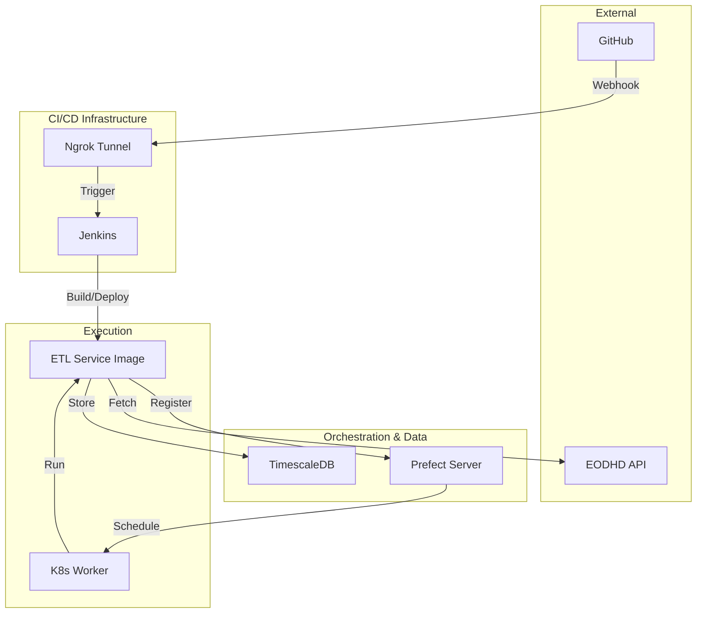

# Tech Learning Center

Welcome to the central documentation hub for our enterprise-grade financial data processing system. This site serves as the "source of truth" for our architectural decisions, coding standards, and deployment workflows.

## System Architecture

The project is built as a **Python Monorepo** managed by **Nx**, utilizing a dispatcher/saver pattern for scalable ETL operations.

### High-Level Flow
1.  **Orchestration**: A unified **Prefect 3.x** cluster manages all scheduled and manual runs.
2.  **Environment Isolation**: Development and Production environments are isolated through:
    -   **Isolated Databases**: Separate TimescaleDB instances (`dev` on 5434, `prod` on 5435).
    -   **Deployment Prefixing**: Deployments are prefixed with `dev-` or `prod-` for logical separation.
3.  **Data Acquisition**: The `etl-service` interacts with the **EODHD API** to fetch historical and real-time market data.
4.  **Persistence**: Data is stored in **TimescaleDB**, optimized using hypertables for time-series performance.

## Core Documentation

### 🏛️ Architecture & Decisions
- [**ADR-001: Unified Cluster**](./architecture/adr-001-single-prefect-cluster.md): The decision to use a single Prefect server for multiple environments.
- [**Multi-Tenancy**](./infrastructure/multi-tenancy.md): Our strategy for environment isolation within shared infrastructure.

### 🛠️ Tooling & Config
- [**Nx & UV**](./tooling/nx-uv.md): How we manage the monorepo and Python dependencies.
- [**Pydantic Settings**](./tooling/pydantic-settings.md): Type-safe, environment-aware application configuration.
- [**Docker**](./infrastructure/docker.md): Containerization of our persistent storage.
- [**Jenkins CI/CD**](./infrastructure/jenkins.md): Automated multi-environment deployment pipeline with **Multibranch** support for automatic PR isolation.
- [**Kubernetes**](./infrastructure/kubernetes.md): The execution environment for our ETL workers.

### 🎭 Orchestration
- [**Prefect Overview**](./orchestration/prefect-overview.md): Understanding the unified cluster strategy.
- [**Setup Guide**](./orchestration/setup-guide.md): How to get the system running locally.
- [**Deployment Pattern**](./orchestration/prefect.md): Deep dive into the Dispatcher/Saver architecture.

### 📊 Database & Data
- [**TimescaleDB**](./database/timescaledb.md): Our time-series database strategy and models.
- [**Storage Client**](./python/packages/storage-client.md): Hybrid storage implementation using Parquet for high-volume intraday data.
- [**EODHD Client**](./api/eodhd-client.md): Documentation for our custom API client.

### 🧪 Quality & Standards
- [**Environment Parity**](./quality/environment-parity.md): Twelve-Factor App compliance and host-to-container bridging.
- [**Testing**](./quality/testing.md): Our strategy for ensuring data integrity and system reliability.

### 🔒 Security & Source Control
- [**Secret Management**](./security/secret-management.md): Securely handling credentials across environments.
- [**Source Control**](./source-control/git.md): Branching and Pull Request workflows.
