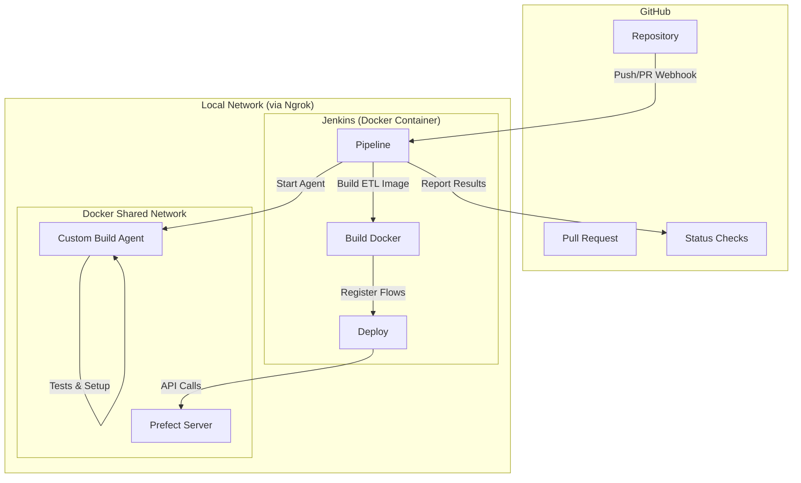

# Jenkins CI/CD

## Overview
This project uses Jenkins for continuous integration and deployment. The pipeline is defined in a scripted `Jenkinsfile` at the root of the repository.

## Automation Architecture


## Jenkins UI
Jenkins provides a web-based interface for managing builds and visualizing pipelines.
*   **Standard View**: Accessible via the main Jenkins URL (default: `http://localhost:8080`).
*   **Blue Ocean**: A modern, interactive visualization of the pipeline stages and logs.

## How to Start Jenkins (Docker)
To run Jenkins locally using Docker, use the following command. This version includes the Docker CLI inside Jenkins so it can build your project images:

```bash
docker run -d `
  --name jenkins `
  -p 8080:8080 -p 50000:50000 `
  -v jenkins_home:/var/jenkins_home `
  -v /var/run/docker.sock:/var/run/docker.sock `
  jenkins/jenkins:lts
```

**Note for Windows users**: Ensure Docker Desktop is running and "Expose daemon on tcp://localhost:2375 without TLS" is enabled, or use the WSL2 backend.

Once started:
1.  Navigate to `http://localhost:8080`.
2.  Retrieve the initial admin password: `docker exec jenkins cat /var/jenkins_home/secrets/initialAdminPassword`.
3.  **Setup Wizard**: Select **"Install suggested plugins"**. This includes essential plugins for this project:
    *   **Pipeline**: Core engine for `Jenkinsfile` execution.
    *   **Git**: For source code management.
    *   **Docker Pipeline**: Required for `docker.image().inside` and containerized stages.
4.  Create your first admin user.

## Advanced: Multibranch Pipelines (Automatic PR Jobs)
Multibranch Pipelines provide isolation for each branch and PR, automatic discovery of new feature branches and pull requests, and automatic cleanup of jobs when branches are deleted.

### Configuration
1.  **Create New Item**: Click "New Item" on the sidebar.
2.  **Item Name**: Enter a name (e.g., `enterprise-level-software-multibranch`).
3.  **Type**: Select **Multibranch Pipeline** and click OK.
4.  **Branch Sources**:
    *   Click **Add source** and select **GitHub**.
    *   **Credentials**: Select the `github-token` (Secret Text).
    *   **Repository HTTPS URL**: `https://github.com/stavyos/enterprise-level-software.git` (or your repo URL).
    *   **Behaviors**:
        *   Enable **Discover branches**.
        *   Enable **Discover pull requests from origin**.
5.  **Build Configuration**:
    *   **Mode**: by Jenkinsfile.
    *   **Script Path**: `Jenkinsfile`.
6.  **Scan Multibranch Pipeline Triggers**:
    *   Check "Periodically if not otherwise run".
    *   Set interval to **1 minute**.
7.  **Save**: Jenkins will automatically scan and create PR jobs named after the PR number (e.g., PR-17).

## Configuring the Pipeline Job
Once logged in, follow these steps to link your repository to Jenkins:

1.  **Create New Item**: Click "New Item" on the sidebar.
2.  **Item Name**: Enter a name (e.g., `enterprise-level-software`).
3.  **Type**: Select **Pipeline** and click OK.
4.  **Pipeline Configuration**:
    *   Scroll down to the **Pipeline** section.
    *   **Definition**: Select **Pipeline script from SCM**.
    *   **SCM**: Select **Git**.
    *   **Repository URL**: Enter your local path or GitHub URL.
    *   **Branch Specifier**: Use `*/master` for production or `*/sy/jenkins-cicd` to test this PR.
    *   **Script Path**: Ensure it is set to `Jenkinsfile`.
5.  **Save**: Click Save.
6.  **Run**: Click **Build Now** on the left sidebar to trigger your first build!

## Connecting Jenkins to GitHub (Local to Cloud)
To allow GitHub to trigger builds and display status checks from your local Jenkins instance, follow these steps:

### 1. Expose Jenkins via Ngrok Tunnel
Since GitHub is on the public cloud, use **Ngrok** to create a secure tunnel:
1.  **Auth**: Run `ngrok config add-authtoken <TOKEN>`.
2.  **Start Tunnel**: Run `ngrok http 8080`.
3.  **Forwarding URL**: Copy the forwarded URL (e.g., `<NGROK_URL>`).

### 2. Configure GitHub Webhook
1.  In your GitHub Repo: **Settings > Webhooks > Add Webhook**.
2.  **Payload URL**: `<NGROK_URL>/github-webhook/` (The `/github-webhook/` suffix is mandatory).
3.  **Content type**: `application/json`.
4.  **Events**: Select **Let me select individual events** and check **Pushes** and **Pull requests**.

### 3. Enable Jenkins Triggers
To allow Jenkins to listen for these webhooks:
1.  **Jenkins URL**: In **Manage Jenkins > System**, set the **Jenkins URL** to your Ngrok URL.
2.  **Job Trigger**: In your Pipeline job configuration, under **Build Triggers**, check **"GitHub hook trigger for GITScm polling"**.

### 4. Enable GitHub Status Checks
To see build results (Success/Failure) directly on your GitHub PRs:
1.  **Install Plugin**: Ensure the **GitHub Integration** plugin is installed in Jenkins.
2.  **Credentials**: Add a GitHub Personal Access Token (PAT) as a "Secret text" credential named `github-token`.
3.  **Global Config**: In **Manage Jenkins > System**, add a GitHub Server, select the `github-token`, and click "Test Connection".
4.  **Pipeline Implementation**: The `Jenkinsfile` uses the `GitHubCommitStatusSetter` step to report status:
    *   **Pending**: Reported after checkout.
    *   **Final Result**: Reported in the `finally` block based on the build outcome (`SUCCESS` or `FAILURE`).

## Pipeline Structure
The pipeline uses **Dockerized Stages** and **Automated Status Reporting**:

1.  **Set Environment**: Runs on the host; determines `dev` or `prod` based on the branch.
    *   **Master Detection**: Uses a precise regex `^(.*/)?master$` to match only the `master` branch.
    *   **Fallback**: All other branches (PRs, features) default to the `dev` environment.
2.  **Status Check (Universal)**: Reports a "Pending" status to GitHub once the build starts.
3.  **Setup & Tests (Dockerized)**: These stages run inside a custom agent image (`jenkins-agent-python`).
    *   Ensures that Node.js, npm, Nx, and `uv` commands run in a Linux environment.
4.  **Build**: Builds the environment-specific application image on the host.
5.  **Deploy**: Runs flow registration **inside** the newly built application image to ensure 100% dependency parity.
6.  **Final Status**: Reports the final Success/Failure to GitHub.
## Environment Isolation
Isolation between `dev` and `prod` is maintained through:
*   **Docker Tags**: Environment-specific images (`etl-service:dev`, `etl-service:prod`).
*   **Env Prefix**: Used to distinguish deployments and flows in the Prefect UI.
*   **Configuration**: Environment-specific `.env` files (loaded during runtime in the container or via `ENV_PREFIX` during deployment).
*   **Templates**: `template.dev.env` and `template.prod.env` provide the structure for environment-specific configuration.

## Requirements
*   Jenkins with `Pipeline` plugin.
*   Node.js and npm installed on the Jenkins runner.
*   `uv` installed and available in the PATH.
*   Docker installed and accessible by the Jenkins user.
*   Prefect server accessible from the Jenkins runner.
