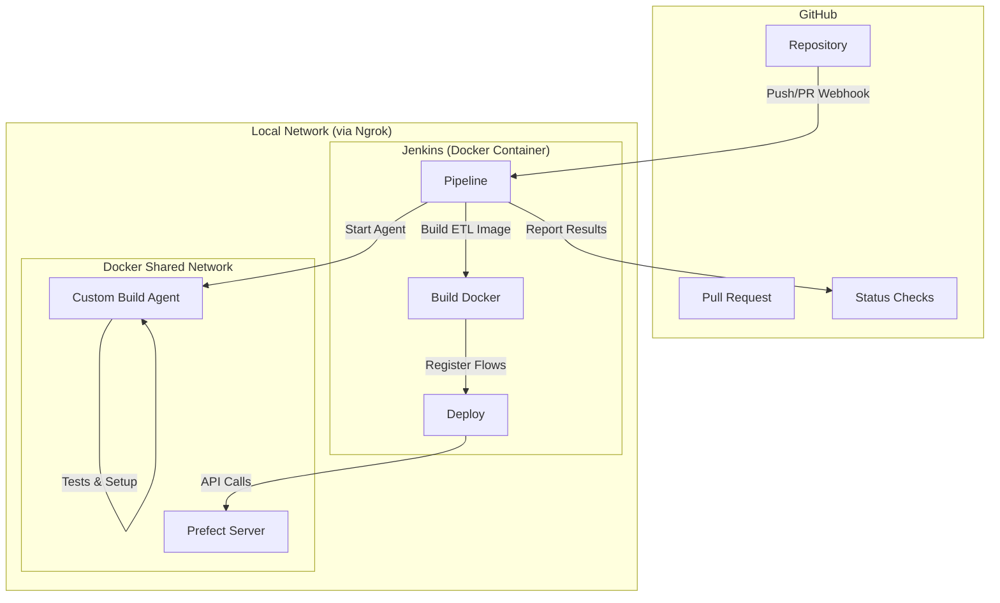

# Jenkins CI/CD

## Overview
This project uses Jenkins for continuous integration and deployment. The pipeline is defined in a scripted `Jenkinsfile` at the root of the repository.

## Automation Architecture


## Jenkins UI
Jenkins provides a web-based interface for managing builds and visualizing pipelines.
*   **Standard View**: Accessible via the main Jenkins URL (default: `http://localhost:8080`).
*   **Blue Ocean**: A modern, interactive visualization of the pipeline stages and logs.

## How to Start Jenkins (Docker Compose)
The project includes a `docker-compose.yaml` file that orchestrates Jenkins along with the TimescaleDB instances. This ensures all services are on the same `enterprise-network` and can communicate easily.

To start Jenkins and the databases:
```bash
docker-compose up -d
```

This configuration includes:
*   **Docker-in-Docker**: The Docker socket is mounted (`/var/run/docker.sock`) so Jenkins can build and run project-specific images.
*   **Persistence**: A volume named `jenkins_home` preserves your jobs, plugins, and configuration.
*   **Networking**: All services share the `enterprise-network`.

**Note for Windows users**: Ensure Docker Desktop is running.

Once started:
1.  Navigate to `http://localhost:8080`.
2.  Retrieve the initial admin password: `docker exec jenkins cat /var/jenkins_home/secrets/initialAdminPassword`.
3.  **Setup Wizard**: Select **"Install suggested plugins"**. This includes essential plugins for this project:
    *   **Pipeline**: Core engine for `Jenkinsfile` execution.
    *   **Git**: For source code management.
    *   **Docker Pipeline**: Required for `docker.image().inside` and containerized stages.
4.  Create your first admin user.

## Configuring the Pipeline Job
Once logged in, follow these steps to link your repository to Jenkins:

1.  **Create New Item**: Click "New Item" on the sidebar.
2.  **Item Name**: Enter a name (e.g., `enterprise-level-software`).
3.  **Type**: Select **Pipeline** and click OK.
4.  **Pipeline Configuration**:
    *   Scroll down to the **Pipeline** section.
    *   **Definition**: Select **Pipeline script from SCM**.
    *   **SCM**: Select **Git**.
    *   **Repository URL**: Enter your local path or GitHub URL.
    *   **Branch Specifier**: Use `*/master` for production or `*/sy/jenkins-cicd` to test this PR.
    *   **Script Path**: Ensure it is set to `Jenkinsfile`.
5.  **Save**: Click Save.
6.  **Run**: Click **Build Now** on the left sidebar to trigger your first build!

## Connecting Jenkins to GitHub (Local to Cloud)
To allow GitHub to trigger builds and display status checks from your local Jenkins instance, follow these steps:

### 1. Expose Jenkins via Ngrok Tunnel
Since GitHub is on the public cloud, use **Ngrok** to create a secure tunnel:
1.  **Auth**: Run `ngrok config add-authtoken <TOKEN>`.
2.  **Start Tunnel**: Run `ngrok http 8080`.
3.  **Forwarding URL**: Copy the forwarded URL (e.g., `<NGROK_URL>`).

### 2. Configure GitHub Webhook
1.  In your GitHub Repo: **Settings > Webhooks > Add Webhook**.
2.  **Payload URL**: `<NGROK_URL>/github-webhook/` (The `/github-webhook/` suffix is mandatory).
3.  **Content type**: `application/json`.
4.  **Events**: Select **Let me select individual events** and check **Pushes** and **Pull requests**.

### 3. Enable Jenkins Triggers
To allow Jenkins to listen for these webhooks:
1.  **Jenkins URL**: In **Manage Jenkins > System**, set the **Jenkins URL** to your Ngrok URL.
2.  **Job Trigger**: In your Pipeline job configuration, under **Build Triggers**, check **"GitHub hook trigger for GITScm polling"**.

### 4. Enable GitHub Status Checks
To see build results (Success/Failure) directly on your GitHub PRs:
1.  **Install Plugin**: Ensure the **GitHub Integration** plugin is installed in Jenkins.
2.  **Credentials**: Add a GitHub Personal Access Token (PAT) as a "Secret text" credential named `github-token`.
3.  **Global Config**: In **Manage Jenkins > System**, add a GitHub Server, select the `github-token`, and click "Test Connection".
4.  **Pipeline Implementation**: The `Jenkinsfile` uses the `GitHubCommitStatusSetter` step to report status:
    *   **Pending**: Reported after checkout.
    *   **Final Result**: Reported in the `finally` block based on the build outcome (`SUCCESS` or `FAILURE`).

## Pipeline Structure
The pipeline uses **Dockerized Stages** and **Automated Status Reporting**:

1.  **Set Environment**: Runs on the host; determines `dev` or `prod` based on the branch.
    *   **Master Detection**: Uses a precise regex `^(.*/)?master$` to match only the `master` branch.
    *   **Fallback**: All other branches (PRs, features) default to the `dev` environment.
2.  **Status Check (Universal)**: Reports a "Pending" status to GitHub once the build starts.
3.  **Setup & Tests (Dockerized)**: These stages run inside a custom agent image (`jenkins-agent-python`).
    *   Ensures that Node.js, npm, Nx, and `uv` commands run in a Linux environment.
4.  **Build**: Builds the environment-specific application image on the host.
5.  **Deploy**: Runs flow registration **inside** the newly built application image to ensure 100% dependency parity.
6.  **Final Status**: Reports the final Success/Failure to GitHub.
## Environment Isolation
Isolation between `dev` and `prod` is maintained through:
*   **Docker Tags**: Environment-specific images (`etl-service:dev`, `etl-service:prod`).
*   **Env Prefix**: Used to distinguish deployments and flows in the Prefect UI.
*   **Configuration**: Environment-specific `.env` files (loaded during runtime in the container or via `ENV_PREFIX` during deployment).
*   **Templates**: `template.dev.env` and `template.prod.env` provide the structure for environment-specific configuration.

## Requirements
*   Jenkins with `Pipeline` plugin.
*   Node.js and npm installed on the Jenkins runner.
*   `uv` installed and available in the PATH.
*   Docker installed and accessible by the Jenkins user.
*   Prefect server accessible from the Jenkins runner.

## Advanced: Multibranch Pipelines (Automatic PR Jobs)
Instead of a single "Pipeline" job, you can use a **Multibranch Pipeline**. This automatically creates a separate job for every branch and Pull Request in your repository.

### Benefits
1.  **Isolation**: Each PR has its own build history and logs.
2.  **Automatic Discovery**: Jenkins automatically creates a job when a new branch is pushed or a PR is opened.
3.  **Automatic Cleanup**: Jenkins deletes the job when the branch is deleted or the PR is merged.

### Configuration
1.  **Create New Item**: Select **Multibranch Pipeline**.
2.  **Branch Sources**:
    - Add **GitHub**.
    - **Repository HTTPS URL**: `https://github.com/your-user/your-repo.git`.
    - **Credentials**: Select your `github-token`.
    - **Behaviors**:
        - **Discover branches**: Detects all branches.
        - **Discover pull requests from origin**: Detects PRs.
3.  **Build Configuration**:
    - **Mode**: by Jenkinsfile.
    - **Script Path**: `Jenkinsfile`.
4.  **Scan Multibranch Pipeline Triggers**: Check "Periodically if not otherwise run" and set it to 1 minute for rapid discovery.

Once saved, Jenkins will scan the repository and create a folder structure where each branch/PR is a sub-job. PRs are typically named `PR-17`, `PR-18`, etc.
