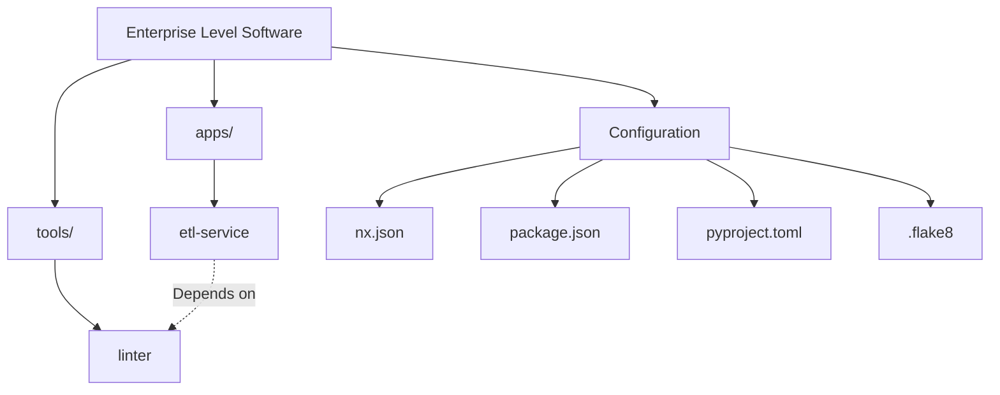

# PR #1: Initial Workspace Configuration

This pull request establishes the core infrastructure for the **Enterprise Level Software** workspace. It provides the foundational configuration and initial project structure.

## Key Changes

### 1. Workspace Configuration
- **Project Structure**: Initialized a monorepo layout using **Nx** for task orchestration.
- **Dependency Management**: Integrated **uv** for high-performance Python package management and **npm** for workspace-level scripts.
- **Linting & Formatting**:
  - Configured **Black** and **Isort** in `pyproject.toml`.
  - Added **Flake8** configuration in `.flake8`.
- **Git & Environment**: Added a comprehensive `.gitignore` to exclude editor-specific files, virtual environments, and build artifacts.
- **Legal**: Added a proprietary `LICENSE.txt`.

## Workspace Visualization

### 2. Core Projects
- **`tools/linter`**: A dedicated library for running standardized linting checks (Flake8, Black, Isort) across the workspace.
- **`apps/etl-service`**: A prototype ETL service application that depends on the `linter` tool and follows the established project conventions.

### 3. CI/CD & Automation
- Configured Nx targets for `install`, `test`, `lint`, and `format`.
- Verified workspace scripts:
  - `npm run install:all`: Sets up Python environments for all projects.
  - `npm run lint:all`: Runs linting across the entire workspace.
  - `npm run test:all`: Executes the test suite for all libraries and applications.

---
*Created on: April 8, 2026*