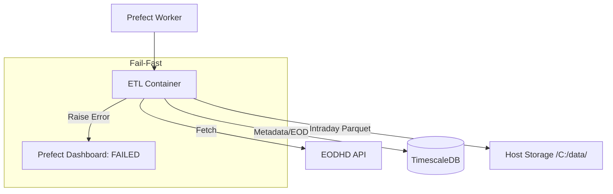

# Pull Request Summary: Hybrid Storage Layer & Fail-Fast Robustness

## Purpose
This PR implements a hybrid storage architecture (TimescaleDB + Parquet) and enforces a "Fail-Fast" error handling policy across all ETL flows. It ensures that high-volume intraday data is persisted efficiently on host storage while providing strict orchestration reliability through explicit flow failures on error.

## Key Changes

### 1. Robustness & Error Handling
- **Fail-Fast Policy**: Updated all ETL scripts (`intraday`, `eod`, `news`, `exchanges`) to raise `RuntimeError` if critical operations fail (API errors, DB upserts, or Parquet saves).
- **Prefect Observability**: By raising exceptions, we ensure that Prefect correctly marks flow runs as `Failed` instead of silently completing with partial data.

### 2. Hybrid Storage Layer
- **New `storage-client` Library**: Encapsulates Parquet persistence using `pyarrow` and `pandas` with Snappy compression.
- **Intraday Parquet Storage**: Offloads high-cardinality 1-minute data to host storage (`C:\enterprise-level-software\data`), partitioned by `symbol` and `bus_date`.
- **Path Logging**: Added explicit logging of the destination Parquet path for improved observability.

### 3. Prefect Orchestration & Infrastructure
- **Portable Deployments**: Refactored `deploy_etls.py` to use `flow.deploy()` with a post-registration step to clear `pull_steps`, forcing workers to use the code baked into the Docker image.
- **Windows Docker Volume Fix**: Implemented a `//c/path` translation layer in `JobVariables` to bypass Pydantic validation errors caused by Windows drive colons.
- **Environment Isolation**: Strictly separates Parquet data into `data/dev` and `data/prd` directories on the host.

### 4. Database UI Management
- **Unified CloudBeaver Instance**: Added a single `cloudbeaver` service (Port 8978) to `docker-compose.yaml` to manage both Dev and Prod connections.
- **Modern Management**: Replaced pgAdmin with CloudBeaver for a sleeker, more responsive web-based administration experience.

## Verification Results
- **Success Case (Single Day)**: Verified full intraday runs for `AAPL.US`, `TSLA.US`, `NVDA.US`, `GOOGL.US`, and `META.US` (959-960 rows each).
- **Success Case (Backfill)**: Successfully executed an optimized 6-year backfill for `MSFT.US` (2020–2026).
    - **Optimization**: Used 120-calendar-day chunking, reducing sub-flows from ~1,600 to ~20.
    - **Integrity**: Confirmed ~56,000 records per 120-day chunk (spanning ~84 business days), correctly partitioned by day on the host filesystem.
- **Failure Case**: Confirmed that providing `INVALID.TICKER` correctly results in a `Failed` state in the Prefect dashboard with a clear `RuntimeError` and traceback.
- **Persistence**: Verified that Parquet files are correctly written to the local NTFS partition and are readable by standard tools.

## Architecture Diagram

## Reviewer Reading Guide
1. `apps/etl-service/src/etl_service/etl/scripts/`: Review the new error-raising logic in all scripts.
2. `libs/storage-client/src/storage_client/parquet.py`: Core Parquet saving logic.
3. `apps/etl-service/src/etl_service/etl/deploy_etls.py`: Portable deployment logic (clearing `pull_steps`).
4. `apps/etl-service/src/etl_service/etl/deployments_settings/job_variables.py`: Windows volume mapping translation.
5. `docs/quality/testing.md`: New documentation for the Fail-Fast policy.
