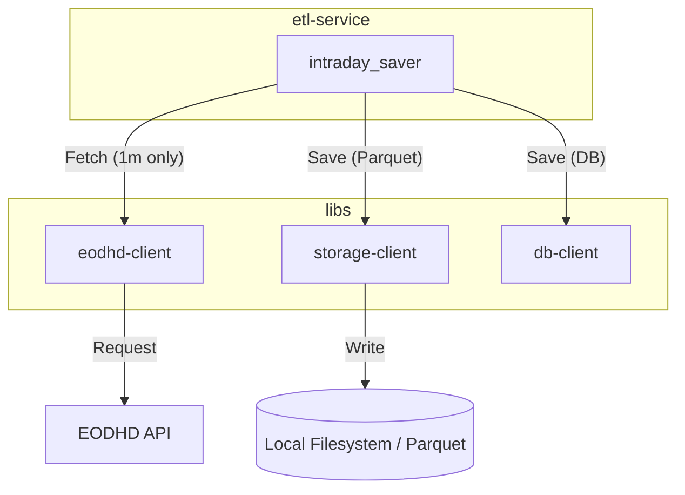

# PR-12: feat: Generic Parquet Storage for 1-Minute Intraday Data

## Purpose
This PR implements a generic and abstract file storage layer for saving intraday stock data in Parquet format. It also enforces a strict 1-minute interval for all intraday data requests to optimize storage efficiency.

## Reviewer Reading Guide
1.  **`libs/storage-client/`**: Start here to see the new abstract storage layer.
2.  **`libs/eodhd-client/src/eodhd_client/stocks_etf_client.py`**: Review the API client changes that enforce the 1-minute interval.
3.  **`apps/etl-service/src/etl_service/etl/scripts/intraday.py`**: See how the ETL script was migrated from database storage to Parquet storage.
4.  **`apps/etl-service/src/etl_service/etl/deployments_settings/settings.py`**: Check the new configuration for the data directory.

## Key Changes
- **New `storage-client` Library**: Provides `LocalParquetStorage` for partitioned Parquet datasets using `pyarrow`.
- **Interval Enforcement**: Removed the `interval` parameter from `get_intraday_data` in the EODHD client, hardcoding it to `"1m"`.
- **ETL Migration**: Updated the intraday ETL process to save data to Parquet files partitioned by `symbol` and `bus_date`.
- **Environment Templates**: Added `DATA_DIR` to `template.dev.env` and `template.prod.env`.
- **Comprehensive Documentation**: Added ADR-002, created `storage-client.md`, and updated all relevant technical docs to reflect the hybrid storage strategy.

## Architecture Diagram

## Date
Monday, April 27, 2026
