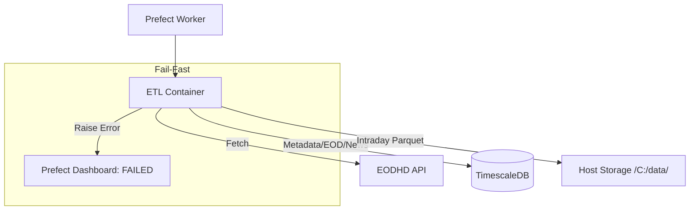

# Pull Request Summary: Hybrid Storage Layer, Fail-Fast Robustness & News Optimization

## Purpose
This PR implements a hybrid storage architecture (TimescaleDB + Parquet), enforces a "Fail-Fast" error handling policy across all ETL flows, and introduces optimized market news acquisition with deep-history pagination and symbol splitting.

## Key Changes

### 1. Robustness & Error Handling
- **Fail-Fast Policy**: Updated all ETL scripts (`intraday`, `eod`, `news`, `exchanges`) to raise `RuntimeError` if critical operations fail (API errors, DB issues, or Parquet saves).
- **Prefect Observability**: By raising exceptions, we ensure that Prefect correctly marks flow runs as `Failed` instead of silently completing with partial data.

### 2. Hybrid Storage & Schema Refinement
- **New `storage-client` Library**: Encapsulates Parquet persistence using `pyarrow` and `pandas` with Snappy compression.
- **Intraday Parquet Storage**: Offloads high-cardinality 1-minute data to host storage (`C:\enterprise-level-software\data`), partitioned by `symbol` and `bus_date`.
- **Database Cleanup**: Removed the `stock_intraday` table from TimescaleDB to prevent bloat.
- **Optimized News Schema**: Migrated `symbols` and `tags` columns in the `market_news` table to the PostgreSQL **`ARRAY(Text)`** type for high-speed indexing and GIN queries.

### 3. Market News Optimization
- **Automatic Pagination**: Implemented `offset`-based loops in the `news_saver` to fetch "as much data as possible," bypassing the 1,000-article API limit.
- **Symbol Splitting**: Updated the News Dispatcher to split comma-separated symbol lists into individual sub-flows to comply with EODHD's single-ticker-per-request rule.
- **Default Limit**: Increased the default news limit to **1,000 articles** across all dispatcher and Pydantic models.

### 4. Prefect Orchestration & Infrastructure
- **Portable Deployments**: Refactored `deploy_etls.py` to use `flow.deploy()` with a post-registration step to clear `pull_steps`, forcing workers to use the code baked into the Docker image.
- **Unified CloudBeaver Instance**: Added a single `cloudbeaver` service (Port 8978) to `docker-compose.yaml` to manage both Dev and Prod connections from one dashboard.
- **Windows Docker Volume Fix**: Implemented a `//c/path` translation layer in `JobVariables` to bypass Pydantic validation errors.

### 5. Documentation & Mandates
- **GEMINI.md Update**: Consolidated the main project mandates to focus exclusively on technical "must-haves" (NTFS paths, Fail-Fast, chunking, and isolation).

## Verification Results
- **Success Case (News Pagination)**: Successfully executed a fetch for **1,500 MSFT news articles**, verified across two API batches and confirmed 1,444 unique records in the database.
- **Success Case (Backfill)**: Successfully executed an optimized 6-year intraday backfill for `MSFT.US` (2020–2026) using **120-calendar-day chunking**.
- **Failure Case**: Confirmed that API errors (e.g., invalid symbols or missing keys) results in a `Failed` state in the Prefect dashboard with clear tracebacks.

## Architecture Diagram

## Reviewer Reading Guide
1. `apps/etl-service/src/etl_service/etl/scripts/news.py`: Review pagination and ARRAY type handling.
2. `apps/etl-service/src/etl_service/etl/flows/etl/news.py`: Review the symbol splitting dispatcher logic.
3. `libs/db-client/src/db_client/models/news.py`: Review the migration to `ARRAY(Text)`.
4. `apps/etl-service/src/etl_service/etl/scripts/intraday.py`: Review the Parquet-only storage logic.
5. `GEMINI.md`: Review the consolidated technical mandates.
