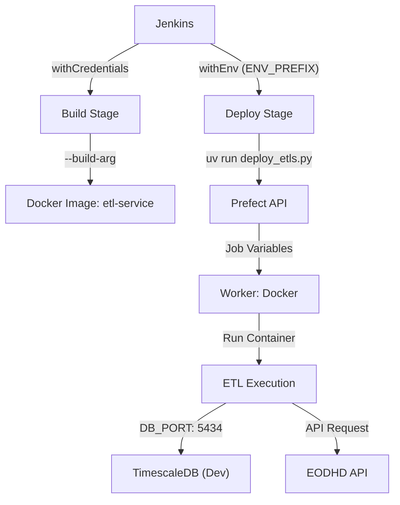

# PR-13: EOD History Persistence & CI/CD Secret Injection

## Purpose
This Pull Request addresses the lack of historical data persistence for EOD and Market News flows and fixes the CI/CD pipeline's inability to inject secrets into Dockerized ETL services. It also resolves a critical data type overflow issue in the database.

## Reviewer Reading Guide
1.  **`apps/etl-service/src/etl_service/flows/etl/eod.py`** & **`news.py`**: Review the new default date logic (`1900-01-01`) for historical backfills.
2.  **`Jenkinsfile`**: Examine the updated secret injection logic using `withCredentials` and `withEnv` during both the `Build` and `Deploy` stages.
3.  **`apps/etl-service/src/etl_service/etl/deploy_etls.py`**: Check the fix for `ENV_PREFIX` detection during deployment registration.
4.  **`libs/db-client/src/db_client/models/stocks.py`**: Verify the change from `Integer` to `BigInteger` for the `volume` column.

## Key Changes
-   **Historical Backfill Defaults**: Refactored EOD and Market News dispatchers to default to `1900-01-01` if no `from_date` is provided, ensuring multi-decade backfills work out-of-the-box.
-   **CI/CD Secret Injection**: Updated `Jenkinsfile` to bake `EODHD_API_KEY` and DB credentials into the Docker image via `--build-arg` and inject them into the Prefect deployment registration environment.
-   **Deployment Registration Fix**: Modified `deploy_etls.py` to correctly pick up `ENV_PREFIX` from the process environment, ensuring `DB_PORT` and `DB_HOST` are correctly set for `dev` vs `prod`.
-   **Ticker Discovery Implementation**: Added a new Ticker model and ETL flow to discover and persist all symbols for given exchanges, enabling automated asset universe management.
-   **Database Schema Update**: Changed `volume` column in `StockEOD` and `StockAdjusted` models to `BigInteger` to support high-volume tickers like AAPL (preventing `NumericValueOutOfRange` errors).
-   **Jenkins Infrastructure**: Programmatically added missing credentials (`EODHD_API_KEY`, `DB_PASSWORD_DEV`, `DB_PASSWORD_PROD`) to the Jenkins server via Groovy.

## Architecture & Workflow

## Verification Results
-   **Jenkins Build #9/10**: SUCCESS.
-   **Prefect Flow Run (`f70ed83e`)**: SUCCESS (EOD Dispatcher).
-   **Prefect Sub-flow Run (`2ddbd643`)**: SUCCESS (EOD Saver for AAPL).
-   **Database**: Confirmed `stock_eod` now contains historical AAPL data with `BigInteger` volume.

**Date**: 2026-05-03
