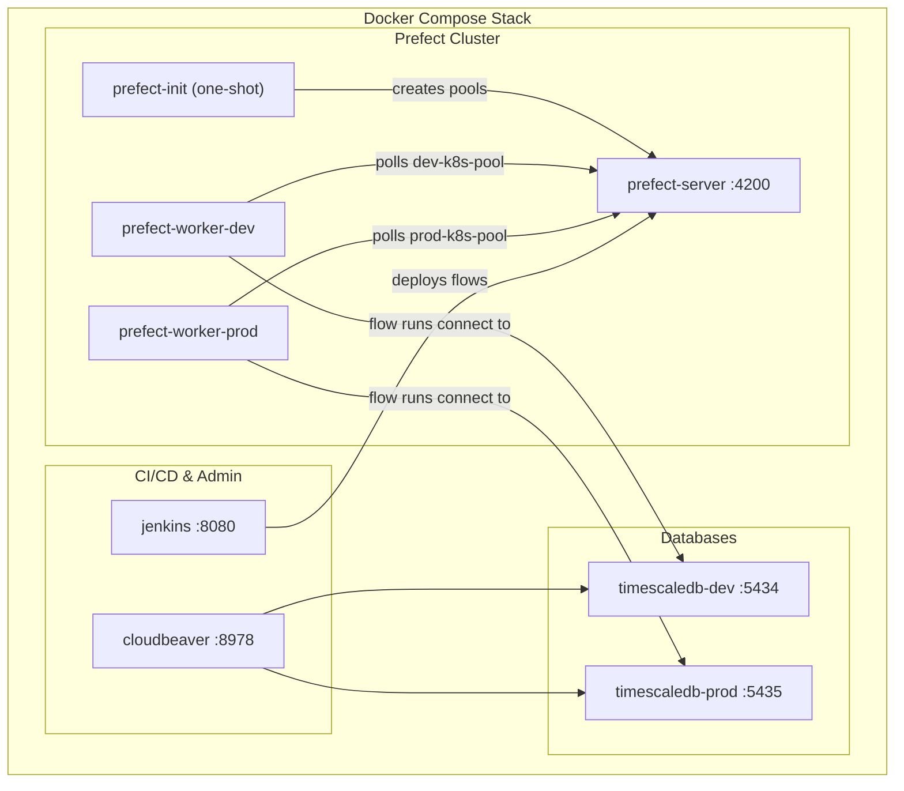

# PR-14: Infrastructure Automation and Orchestration Optimization

## Purpose

This PR finalized the containerized Prefect orchestration ecosystem and implements critical performance optimizations. It transitions the infrastructure to a fully automated `docker-compose.yaml` stack while stabilizing deployment concurrency, resource allocation, and data integrity for high-volume ETL flows.

## Reviewer Reading Guide

1. **Automation**: Review `docker-compose.yaml` for the new Prefect server, init, and worker services.
2. **Resource Tuning**: Check `exchanges.py` for rightsized CPU/Memory and increased concurrency limits.
3. **Data Integrity**: Review `stocks.sql` and `stocks.py` for the `BIGINT` volume upgrade and `eod.py` for the single-ticker refactor.
4. **Operational Rules**: See `GEMINI.md` for the new `curl.exe` requirement on Windows.

## Key Changes

### Infrastructure & Automation (`docker-compose.yaml`)

| Change | Details |
|--------|---------|
| **Prefect Server** | Added `prefect-server` service (port `4200`) with a Python-based healthcheck. |
| **Prefect Init** | One-shot container auto-creates `dev-k8s-pool` and `prod-k8s-pool` work pools on startup. |
| **Prefect Workers** | `prefect-worker-dev` and `prefect-worker-prod` now run as persistent containers polling their respective pools. |
| **Deployment Registration** | Updated `deploy_etls.py` to enforce `concurrency_limit` on the Prefect server during registration. |

### Orchestration Performance Tuning

| Component | Optimization |
|-----------|--------------|
| **Exchanges Saver** | Rightsized: CPU `1` -> `0.25`, Memory `2Gi` -> `1Gi`. |
| **Concurrency** | Increased `Exchanges` saver concurrency to **10** (Global default: **6**). |
| **EOD Dispatcher** | Fixed `ValidationError` by ensuring `from_date` defaults to `1900-01-01`. |
| **EOD Saver** | Refactored to process **one ticker per flow run** (`chunk_size=1`) for improved granularity. |

### Data Integrity & Schema

| File | Change |
|------|--------|
| `libs/db-client/stocks.sql` | Upgraded `volume` columns in `stock_eod` and `stock_adjusted` from `INTEGER` to `BIGINT`. |
| `libs/db-client/models/stocks.py` | Updated SQLAlchemy models to use `BigInteger` for volume. |
| `libs/db-client/models/eod.py` | Refactored `EODSaveRequest` to handle single-ticker requests. |

### Operational Rules

| File | Change |
|------|--------|
| `GEMINI.md` | Added rule to use `curl.exe` instead of `curl` for Prefect API on Windows. |

## Architecture Diagram

## Verification

- ✅ All infrastructure services start automatically with `docker-compose up -d`.
- ✅ Prefect deployments correctly registered with enforced concurrency limits.
- ✅ EOD saver successfully handles high-volume tickers (e.g., `AGRO.BA`) via `BIGINT`.
- ✅ Exchanges saver dispatcher successfully handles 10 concurrent runs.
