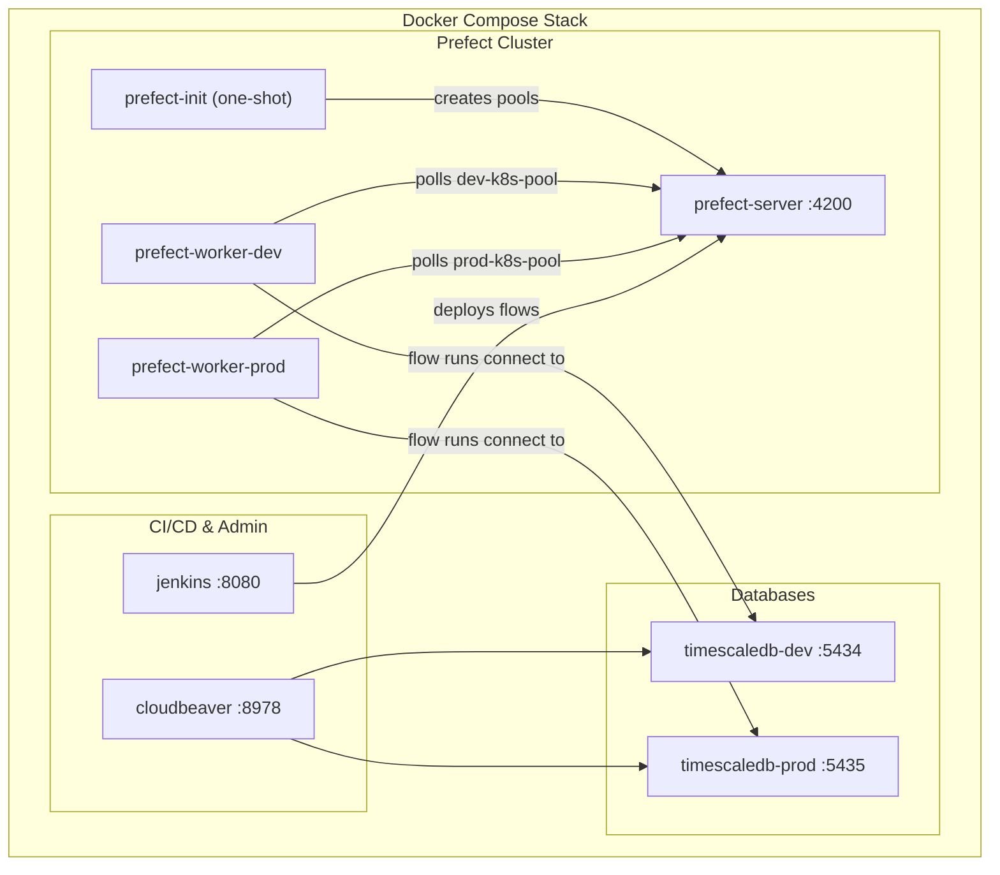

# PR-14: Fully Automated Prefect & Infrastructure Docker Compose Stack

## Purpose

This PR completes the containerization of all infrastructure services into a single, self-healing `docker-compose.yaml` stack. Previously, the Prefect server and workers had to be started manually. Now, running `docker-compose up -d` brings up the entire platform — databases, Prefect server, work pool initialization, workers, Jenkins, and CloudBeaver — with zero manual intervention.

## Reviewer Reading Guide

1. Start with `docker-compose.yaml` — this is the core of the PR. Review the new Prefect services (server, init, workers) and their dependency chain.
2. Check `GEMINI.md` for updated operational rules reflecting the new automated workflow.
3. Review the docs updates (`docs/orchestration/`, `docs/infrastructure/`) for accuracy against the compose file.

## Key Changes

### Infrastructure (`docker-compose.yaml`)

| Change | Details |
|--------|---------|
| **Prefect Server** | Added `prefect-server` service (port `4200`) with a Python-based healthcheck. State persisted in `prefect_data` volume. |
| **Prefect Init** | Added `prefect-init` one-shot container that auto-creates `dev-k8s-pool` and `prod-k8s-pool` work pools using `--if-not-exists` for idempotency. Waits for server healthcheck before running. |
| **Dev Worker** | Added `prefect-worker-dev` — polls `dev-k8s-pool`, installs `prefect-docker` at startup, mounts Docker socket for container execution. |
| **Prod Worker** | Added `prefect-worker-prod` — same as dev but polls `prod-k8s-pool`. |
| **Jenkins Volume Fix** | Changed Jenkins volume from named volume to bind mount (`../../jenkins_home`) to prevent data loss when recreating containers from worktrees. |
| **CloudBeaver Auth** | Added `CB_ADMIN_NAME` and `CB_ADMIN_PASSWORD` env vars mapped from `dev.env`. |

### Documentation

| File | Changes |
|------|---------|
| `GEMINI.md` | Updated Prefect operational rules: server, init, and workers are now Docker Compose services. Removed manual startup instructions. |
| `docs/orchestration/setup-guide.md` | Full rewrite — single `docker-compose up -d` command, service table, automated Prefect section. |
| `docs/orchestration/prefect-overview.md` | Updated Infrastructure/Execution sections to reference Docker Compose containers. |
| `docs/infrastructure/docker.md` | Added "Prefect Orchestration Stack" section with service table. Updated startup command. |

### Database

| File | Changes |
|------|---------|
| `libs/db-client/stocks.sql` | Added `virgin_tickers` table definition for tracking tickers pending backfill. |

## Architecture Diagram

## Verification

- ✅ All containers start successfully with `docker-compose up -d`
- ✅ Prefect healthcheck passes, init container creates work pools
- ✅ Both `dev-k8s-pool` and `prod-k8s-pool` show online workers in the Prefect UI
- ✅ Jenkins CI/CD pipeline passes (checkout, tests, build, deploy stages)
- ✅ Jenkins can reach Prefect server via `http://prefect-server:4200/api` on the `enterprise-network`
