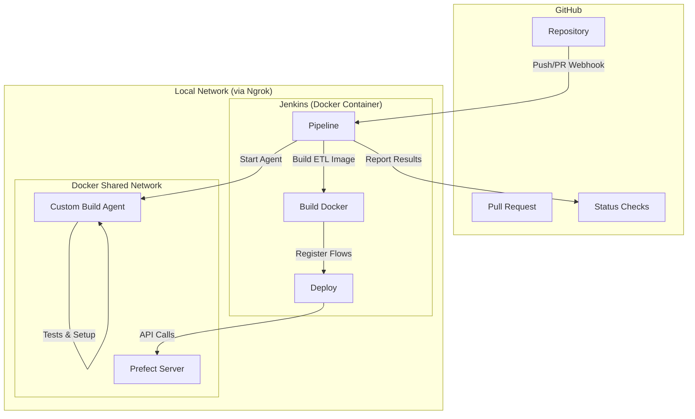

# PR-15: Multi-Environment Jenkins CI/CD Pipeline Implementation

## Purpose
This Pull Request introduces a fully automated, multi-environment CI/CD pipeline using Jenkins. It provides a standardized way to build, test, and deploy the entire monorepo, ensuring environment consistency and security.

## Reviewer Reading Guide
1. **`Jenkinsfile`**: The core scripted pipeline logic.
2. **`Dockerfile.jenkins-agent`**: The custom agent image used for builds and tests.
3. **`docs/infrastructure/jenkins.md`**: Complete guide for setup and connectivity.
4. **README updates**: Overview of the new automation capabilities.

## Key Changes

### 1. Scripted Jenkins Pipeline
- Implemented a robust `Jenkinsfile` with automatic branch detection.
- **Set Environment**: Uses regex to map `master` to Prod and all other branches to Dev.
- **Dockerized Stages**: Setup and Tests run inside a custom Python/Node.js agent.
- **Deploy Stage**: Runs flow registration inside the application's own Docker container.
- **GitHub Status Checks**: Real-time build results reported directly to PRs.

### 2. Infrastructure & Networking
- Established a shared Docker network (`enterprise-network`) for Jenkins, Prefect, and Workers.
- Documented the use of **Ngrok** to connect local Jenkins to GitHub webhooks.

### 3. Comprehensive Documentation
- Created a technical deep-dive in `docs/infrastructure/jenkins.md`.
- Updated all `README.md` files across the monorepo to reflect CI/CD standards.

## Architecture & Dependency Graph

## Date
Saturday, April 25, 2026
