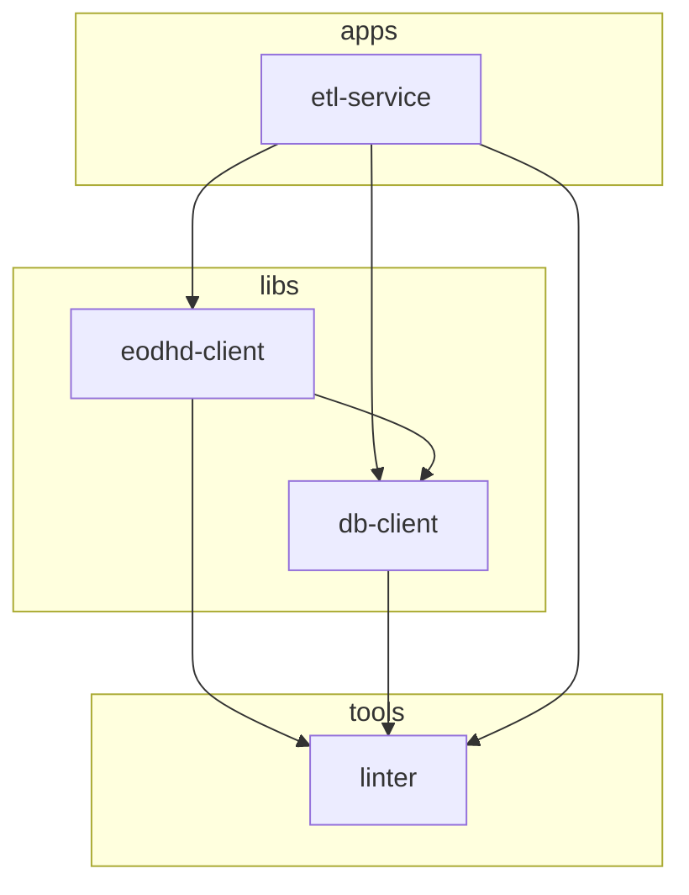

# PR-2: Initialize EODHD and Database client libraries

## Purpose
This PR initializes and restructures the core data acquisition and storage layers of the enterprise-level stock software. It introduces the `eodhd-client` for robust interaction with the EODHD API and the `db-client` for structured, high-performance storage using SQLAlchemy and TimescaleDB.

## Environment Setup

### 1. Database (Docker)
This project uses **TimescaleDB** (PostgreSQL with time-series extensions). To start a fresh instance:

```bash
docker run -d \
  --name timescaledb \
  -p 5430:5432 \
  -e POSTGRES_PASSWORD=postgres \
  -v timescaledb_data:/var/lib/postgresql/data \
  timescale/timescaledb-ha:pg17
```

### 2. Local Configuration
Create a `.env` file in the root of the project (and copy it to your worktree) with the following content:

```env
# Database Configuration
DB_HOST=localhost
DB_PORT=5430
DB_USER=postgres
DB_PASSWORD=postgres
DB_NAME=postgres

# EODHD API Configuration
EODHD_API_KEY=your_api_key_here
```

### 3. Schema Generation
Once the database is running, generate the initial SQL schema by running the generation script in the `db-client` library:

```bash
# From libs/db-client
uv run python src/db_client/models/create_tables.py
```
This will produce a `stocks.sql` file optimized for TimescaleDB Hypertables.

## Reviewer Reading Guide
To best understand the changes in this PR, it is recommended to review the files in the following order:

### 1. High-Level Overview
- **`pull_requests/PR-2.md`**: Start here (you are here!) to understand the purpose and see the architectural diagram.
- **`docs/index.md`**: Explore the new **Tech Learning Center** to understand our tech stack (Python, Packages, Database, Docker, Git, GitHub, and API security).

### 2. Core API Foundation (`libs/eodhd-client`)
- **`src/eodhd_client/client.py`**: The base client implementation. Understand how requests, retries, and error handling are centralized.
- **`src/eodhd_client/rate_limiter.py`**: Review the cost-aware sliding window logic.
- **`src/eodhd_client/endpoint_cost.py`**: See how different API endpoints are weighted.

### 3. Data Persistence Layer (`libs/db-client`)
- **`src/db_client/models/stocks.py`**: The "Source of Truth" for our data structures. Review the SQLAlchemy models.
- **`src/db_client/models/create_tables.py`**: Understand how we generate the SQL schema and optimize for **TimescaleDB**.
- **`src/db_client/client.py`**: Review the database interaction logic (upserts/queries).

### 4. Specialized API Implementations
- **`src/eodhd_client/stocks_etf_client.py`** & **`exchanges_client.py`**: See how the base client is extended for specific data domains.

### 5. Integration & Standards
- **`apps/etl-service/pyproject.toml`**: Review the cleanup of legacy dependencies.
- **`tools/linter/src/linter/run_linters.py`**: Observe the application of modern Python typing (`list[str]`, etc.) and enhanced documentation standards.

## Key Components

### 1. EODHD Client Library (`libs/eodhd-client`)
A modular client designed to handle the complexities of interacting with the EODHD API.
- **Base Client (`EODHDClientBase`)**: Implements standard request handling, including automatic retries, comprehensive error mapping (401, 400, 404, 429, 5xx), and a redacted logging mechanism for security.
- **Smart Rate Limiting**:
    - **`RateLimiter`**: A cost-aware sliding window rate limiter.
    - **`CompositeRateLimiter`**: Coordinates multiple limits (e.g., daily and per-minute) simultaneously.
- **Endpoint Cost Management**: Automatically determines API call costs based on the endpoint (e.g., `fundamentals` cost 10, `eod` cost 1).
- **Specialized Clients**:
    - `ExchangesClient`: Ticker discovery and exchange metadata.
    - `StocksETFClient`: EOD, Intraday, Dividends, and Splits data retrieval.

### 2. Database Client Library (`libs/db-client`)
A SQLAlchemy-based client for managing financial data in a PostgreSQL/TimescaleDB environment.
- **Modular Model Structure**: Models are separated into a dedicated `models/` package for better maintainability.
- **Core Models**:
    - `StockEOD`: End-Of-Day historical data.
    - `StockAdjusted`: Price-adjusted historical data.
    - `StockDividends`: Corporate dividend events.
    - `StockIntraday`: High-frequency intraday price data.
    - `StockSplits`: Stock split events.
- **Schema Generation**: Includes a SQL generation script (`create_tables.py`) that automatically produces schema definitions with **TimescaleDB Hypertables** for time-series optimization.

### 3. Engineering Standards & Refactoring
- **Modern Python Typing**: Updated the entire codebase (including the `linter` tool) to use PEP 585/604 typing (e.g., `list[str]` instead of `List[str]`, `X | Y` instead of `Union[X, Y]`).
- **Comprehensive Documentation**: Added Google-style docstrings to all new methods and classes, documenting purpose, arguments, and return values.
- **Workspace Configuration**: Updated `.gitignore` to ensure `.env` and `.nx/` cache files are not tracked.
- **ETL Service Cleanup**: Refactored `apps/etl-service` to remove legacy Prefect dependencies and align with the new library architecture.
- **Metadata Management**: Standardized author information to "Stav Yosef" across all library configurations.

## Architectural Changes


## Testing & Validation
- **Unit Tests**: Added initial test suites for both `eodhd-client` and `db-client`.
- **Validation**: Verified all projects in the workspace via `uv run pytest` and Nx targets.
- **Dependency Management**: Standardized `uv.lock` files across the workspace.

## Date
2026-04-08
