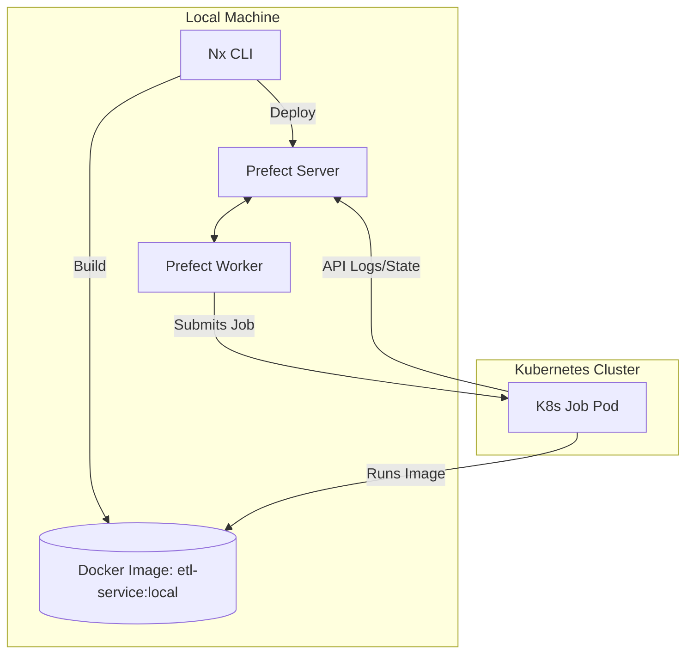

# PR-3: Prefect 3.x & Kubernetes Integration for ETL Service

## Purpose
This PR introduces a robust, containerized workflow orchestration layer using **Prefect 3.x** and **Kubernetes**. It enables distributed ETL execution with fine-grained resource management, automated flow registration, and structured logging.

## Reviewer Reading Guide
1.  **Apps**:
    - `apps/prefect-orchestrator`: Manages the control plane (server/worker).
    - `apps/etl-service`: Contains the actual ETL logic and Prefect flows.
2.  **Core Orchestration**:
    - `apps/etl-service/src/etl_service/etl/deployments_settings/`: Look at the `AbstractDeploymentSettings` and `JobVariables` for K8s resource mapping.
    - `apps/etl-service/src/etl_service/etl/deploy_etls.py`: The automation script for registering all flows.
3.  **Infrastructure**:
    - `Dockerfile.etl`: The root-level recipe for building the ETL execution environment.
4.  **Documentation**:
    - `docs/orchestration/`: New comprehensive guides for setup and architecture.

## Key Changes
### 1. Prefect Orchestrator App
- Created a dedicated application to manage the Prefect server.
- Added Nx targets for starting the server (`run`) and the worker (`worker`).
- Pinned dependencies: `prefect==3.6.25`, `prefect-kubernetes==0.7.7`.

### 2. Containerized ETL Architecture
- **Dockerfile Integration**: Introduced `Dockerfile.etl` to package the workspace into a Linux-compatible image.
- **Image-Based Execution**: Refactored deployments to use `RunnerDeployment.from_entrypoint`, ensuring flows execute using code baked into the image rather than host-machine paths.
- **Resource Management**: Implemented dynamic Kubernetes Job specification generation with configurable CPU/Memory requests and limits.

### 3. Structured ETL Module
- Replicated a hierarchical ETL structure:
    - `flows/etl/`: Implementation of EOD, Intraday, and Exchanges flows.
    - `deployments_settings/`: Metadata-driven configuration for flows (concurrency, schedules, jobs).
    - `scripts/`: Direct data processing functions.
- **Import Normalization**: Cleaned up all cross-module imports to use the local `etl_service` namespace.

### 4. Advanced Orchestration Features
- **Individual Concurrency**: Set dynamic limits (Dispatcher: 1, Saver: 2) via `AbstractDeploymentSettings`.
- **Loguru Integration**: Added a custom decorator to redirect structured Loguru logs to the Prefect run logger for centralized observability.
- **K8s Networking**: Configured explicit `PREFECT_API_URL` passing to jobs via `host.docker.internal` for local development compatibility.

## Architecture Visualization



## Setup & Execution
```bash
# 1. Start Server
npx nx run prefect-orchestrator:run

# 2. Configure API (Local)
uv run prefect config set PREFECT_API_URL=http://127.0.0.1:4200/api

# 3. Build Image
npx nx run etl-service:docker-build

# 4. Register Flows
npx nx run etl-service:deploy

# 5. Start Worker
npx nx run prefect-orchestrator:worker
```

## Date
Thursday, April 10, 2026
