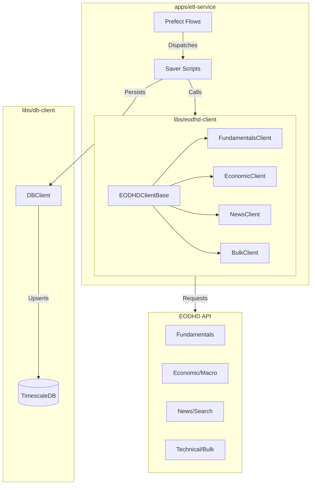

# PR-4: Complete EODHD Endpoints, Persistence Layer, and ETL Flows

## Purpose
This PR achieves 100% coverage of the EODHD API endpoints by expanding the `eodhd-client` library, updating the `db-client` persistence layer with new models, and implementing corresponding ETL flows in `etl-service`.

## Reviewer Reading Guide

To understand these changes effectively, please review the files in the following order:

### 1. Foundational Libraries (The "How")
Start here to see how we interact with external systems.
- **`libs/eodhd-client`**: Implementation of specialized clients (`Bulk`, `Technical`, `News`, `RealTime`, `Search`) and the lazy-loading property pattern in `client.py`.
- **`libs/db-client`**: New SQLAlchemy models for `MarketNews` and `TechnicalIndicator`, and their corresponding upsert methods in `DBClient`.

### 2. Functional Logic (The "What")
These scripts contain the core business logic, bridging the clients and the database.
- **`apps/etl-service/src/etl_service/etl/scripts/`**: Implementation of saver logic for `eod`, `intraday`, `news`, `technical`, and `bulk` data.

### 3. Workflow Orchestration (The "Orchestrator")
Review how the functional logic is wrapped into scalable pipelines.
- **`apps/etl-service/src/etl_service/etl/flows/etl/`**: Implementation of the **Dispatcher/Saver pattern** for each data category.

### 4. Infrastructure & Configuration
Configuration for running the system at scale.
- **`apps/etl-service/src/etl_service/etl/deployments_settings/`**: Kubernetes job variables, resource limits, and flow-to-settings mapping.
- **`libs/db-client/src/db_client/models/create_tables.py`**: Updated hypertable generation logic and the resulting `stocks.sql`.

### 5. Documentation & Metadata
Final verification of project documentation and workspace settings.
- **Root `README.md`** and **Sub-project READMEs**: Updated to reflect the new capabilities.
- **`docs/`**: New technical guides in the "Tech Learning Center".
- **`.gitignore`**: Added workspace protection rules.

## Key Changes
### 1. EODHD Client Expansion
- **Specialized Clients**: Implemented 5 new specialized clients, each inheriting from `EODHDClientBase` with lazy-loading support.
- **Endpoint Coverage**: Added support for Bulk EOD, Technical Indicators, Real-Time Data, News, and Search.
- **Rate Limiting**: Updated `EndpointCost` with costs for all new endpoints.

### 2. Persistence Layer Enhancements
- **New Models**: Introduced SQLAlchemy models for `MarketNews` and `TechnicalIndicator`.
- **TimescaleDB Optimization**: Configured time-series tables as Hypertables for high-performance querying and storage.
- **DBClient Expansion**: Added `insert_*` and `get_*` methods for new data categories, utilizing `session.merge()` for robust upsert behavior.

### 3. ETL Flow Completion
- **Dispatcher/Saver Pattern**: Implemented the standardized "Dispatcher/Saver" pattern for all new flows to ensure scalability and parallel execution.
- **Pydantic Validation**: Created structured request/response models for each flow to ensure data integrity.
- **K8s Integration**: Defined deployment settings and resource requirements (CPU/Memory) for all new flows.

### 4. Bug Fixes & Verification
- **Endpoint Correction**: Fixed critical path and parameter errors for `Bulk EOD`, `Technical Indicators`, and `Search` APIs identified during manual verification.
- **Verification Script**: Validated all implemented endpoints against the live EODHD API using a production token.

### 5. Root Workspace Cleanup
- **`.gitignore`**: Added patterns for `.gemini`, `.nx`, `.env`, and `todos/` to prevent accidental commits of local configuration and temporary files.
- **`package-lock.json`**: Synchronized the package lock file for the workspace.

## Architecture Visualization

## Date
Friday, April 10, 2026
