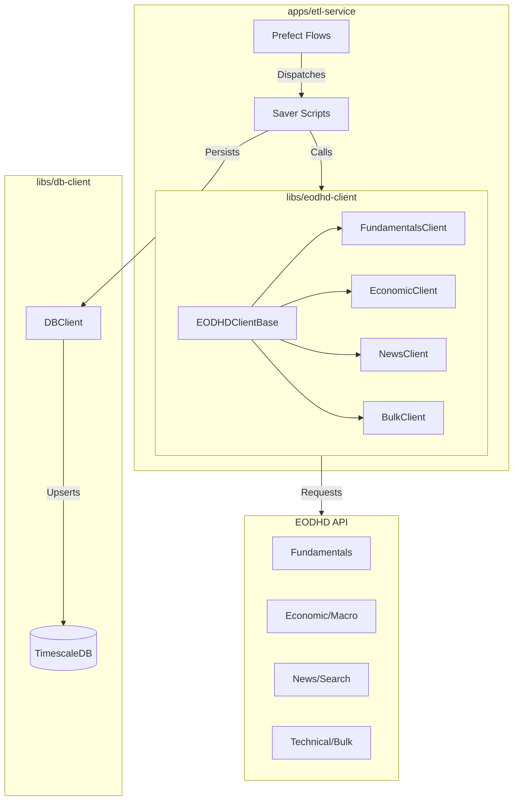

# PR-4: Complete EODHD Endpoints, Persistence Layer, and ETL Flows

## Purpose
This PR achieves 100% coverage of the EODHD API endpoints by expanding the `eodhd-client` library, updating the `db-client` persistence layer with new models, and implementing corresponding ETL flows in `etl-service`.

## Reviewer Reading Guide
1.  **Libraries**:
    - `libs/eodhd-client`: New specialized clients (`Bulk`, `Technical`, `News`, `RealTime`, `Search`).
    - `libs/db-client`: New SQLAlchemy models and `DBClient` methods for data persistence (News, Technical).
2.  **ETL Flows**:
    - `apps/etl-service/src/etl_service/etl/flows/etl/`: Implementation of new Prefect flows (News, Technical, Bulk).
    - `apps/etl-service/src/etl_service/etl/scripts/`: Saver logic for each data category.
3.  **Infrastructure**:
    - `libs/db-client/src/db_client/models/create_tables.py`: Updated to include new tables and TimescaleDB hypertables.
    - `libs/db-client/src/stocks.sql`: Regenerated schema.

## Key Changes
### 1. EODHD Client Expansion
- **Specialized Clients**: Implemented 5 new specialized clients, each inheriting from `EODHDClientBase` with lazy-loading support.
- **Endpoint Coverage**: Added support for Bulk EOD, Technical Indicators, Real-Time Data, News, and Search.
- **Rate Limiting**: Updated `EndpointCost` with costs for all new endpoints.

### 2. Persistence Layer Enhancements
- **New Models**: Introduced SQLAlchemy models for `MarketNews` and `TechnicalIndicator`.
- **TimescaleDB Optimization**: Configured time-series tables as Hypertables for high-performance querying and storage.
- **DBClient Expansion**: Added `insert_*` and `get_*` methods for new data categories, utilizing `session.merge()` for robust upsert behavior.

### 3. ETL Flow Completion
- **Dispatcher/Saver Pattern**: Implemented the standardized "Dispatcher/Saver" pattern for all new flows to ensure scalability and parallel execution.
- **Pydantic Validation**: Created structured request/response models for each flow to ensure data integrity.
- **K8s Integration**: Defined deployment settings and resource requirements (CPU/Memory) for all new flows.

### 4. Bug Fixes & Verification
- **Endpoint Correction**: Fixed critical path and parameter errors for `Bulk EOD`, `Technical Indicators`, and `Search` APIs identified during manual verification.
- **Verification Script**: Validated all implemented endpoints against the live EODHD API using a production token.

## Architecture Visualization

## Date
Friday, April 10, 2026
