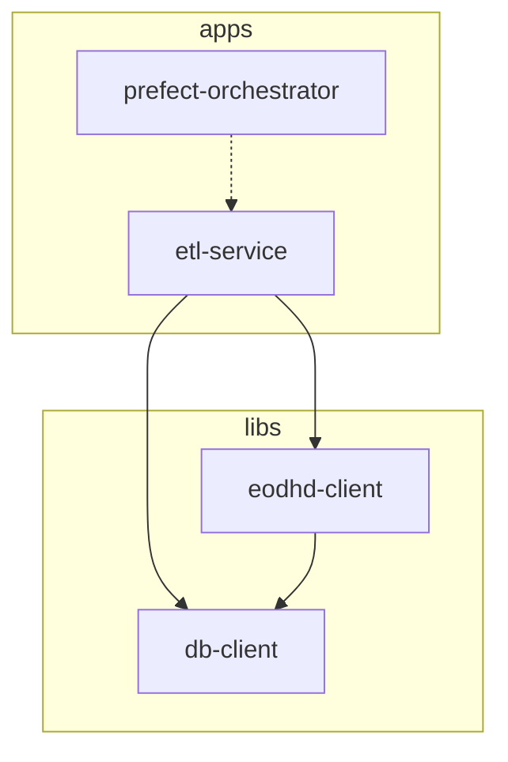

# PR-7: Fix ETL Flows, Redesign Settings & Enhance Logging

## Purpose
This Pull Request resolves critical issues in the ETL pipeline orchestration within the Kubernetes environment. It stabilizes module loading, ensures consistent database connectivity from within pods, migrates configuration to a robust Pydantic-based architecture, and implements row-count logging for better observability.

## Reviewer Reading Guide
1. **``apps/etl-service/src/etl_service/etl/deployments_settings/settings.py``**: Start here to see the new centralized configuration management.
2. **``apps/etl-service/src/etl_service/etl/deployments_settings/job_variables.py``**: Review how environment variables are now injected into Kubernetes pods.
3. **``apps/etl-service/src/etl_service/etl/deploy_etls.py``**: Examine the fixes for deployment paths and registration.
4. **``libs/db-client/src/db_client/client.py``**: Check the modifications to support success-tracking in database operations and reduced log noise.
5. **``apps/etl-service/src/etl_service/etl/scripts/``**: See the enhanced logging, periodic progress updates, and safer data handling in all ETL scripts.
6. **``apps/etl-service/src/etl_service/etl/flows/etl/``**: Review the updates to flow dispatchers ensuring mandatory parameters and resolved logic gaps.

## Key Changes

### 1. Architectural Redesign: Pydantic BaseSettings
- Implemented a unified ``Settings`` class in ``settings.py`` using Pydantic ``BaseSettings``.
- Centralized all environment variables (API keys, Database credentials, Prefect config) with validation.
- Decoupled host-environment paths from Kubernetes job variables by introducing ``job_pythonpath``.

### 2. Kubernetes Stability Fixes
- **Module Discovery**: Updated ``Dockerfile.etl`` to explicitly install the ``etl-service`` package into the system Python, resolving ``ModuleNotFoundError``.
- **Deployment Paths**: Redesigned ``deploy_etls.py`` to use the ``RunnerDeployment.from_entrypoint`` method properly, ensuring no host-specific absolute paths are recorded.
- **Connectivity**: Implemented dynamic ``DB_HOST`` switching to ``host.docker.internal`` for pods when running against a local database.

### 3. ETL Flow Enhancements & Orchestration Fixes
- **Merge Conflict Resolution**: Resolved critical syntax errors caused by merge conflicts in ``base.py`` and ``db_client/client.py``, restoring stable deployment and database operations.
- **Main Orchestrator Fix**: Updated ``main_saver_dispatcher`` to make ``tickers`` a mandatory parameter with strict Pydantic validation (minimum length of 1). Propagated it correctly to sub-dispatchers, enabling fully automated tiered execution.
- **Exchanges Implementation**: Fully implemented the ``Exchanges-Saver`` flow, including database models, client insertion logic, and API integration (73 exchanges successfully mapped).
- **Removal of Legacy Flows**: Removed the ``Technical Indicators`` deployment and associated flows (saver, dispatcher, models) as they are no longer required.
- **Mandatory Parameters**: Updated all dispatchers (``EOD``, ``Intraday``, ``Bulk``, ``News``) to ensure identifying parameters like ``tickers`` or ``countries`` are strictly required.
- **Logging Standardization**: Standardized database client logs to use ``INFO`` level for all successful row insertions/updates, providing better visibility during execution.
- **Connectivity Stability**: Implemented dynamic ``DB_HOST`` switching to ``host.docker.internal`` for pods, ensuring stable database connections across both local and containerized environments.
- **Dispatcher Logic**: Completed the missing implementation for ``Main Date Range-Saver`` dispatcher.
- **Observability**:
    - Modified ``DBClient`` to return success indicators for all insertion methods.
    - Implemented **Bulk Upsert** capability in ``DBClient``, allowing multiple records to be processed in a single session/commit.
    - Standardized database client logs to use ``DEBUG`` level for individual row insertions and ``INFO`` level for batch summaries, significantly reducing log noise during high-volume runs.
    - Updated all ETL scripts (``EOD``, ``Intraday``, ``Bulk``, ``News``, ``Exchanges``) to use batch processing for better performance and observability.
    - Implemented **periodic progress updates** (e.g., every 1000 records for bulk EOD) to provide visibility during long-running tasks without overwhelming the logs.
- **Robustness**: Implemented safer dictionary access (``.get()``) across all scripts to handle potential missing fields from API responses.
- **Bug Fix**: Corrected field names for bulk dividends (``unadjustedValue``, etc.).

### 4. Documentation & Workspace
- Updated ``README.md`` with explicit Prefect startup and worker instructions.
- Enhanced ``GEMINI.md`` with comprehensive Project Rules, Engineering Standards, and **Prefect CLI Operation guidelines** to prevent common querying errors.
- Corrected ``.gitignore`` to track ``GEMINI.md``.

## Workspace Dependency Graph

## Date
Sunday, April 12, 2026
