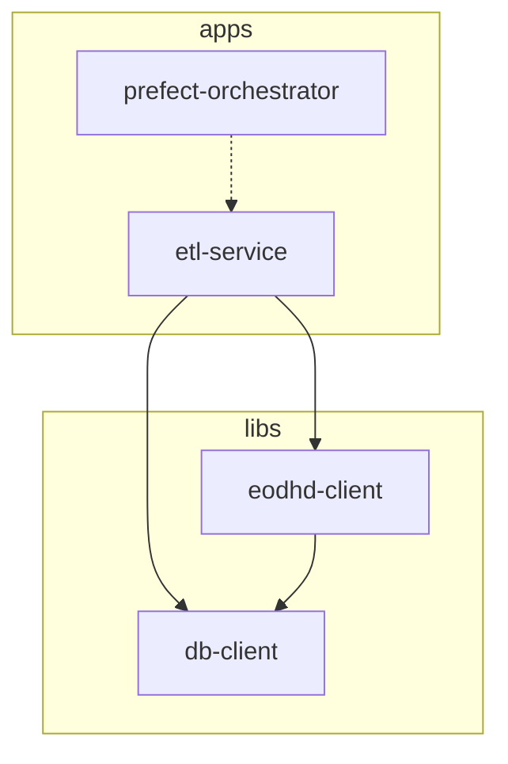

# PR-7: Fix ETL Flows, Redesign Settings & Enhance Logging

## Purpose
This Pull Request resolves critical issues in the ETL pipeline orchestration within the Kubernetes environment. It stabilizes module loading, ensures consistent database connectivity from within pods, migrates configuration to a robust Pydantic-based architecture, and implements row-count logging for better observability.

## Reviewer Reading Guide
1. **`apps/etl-service/src/etl_service/etl/deployments_settings/settings.py`**: Start here to see the new centralized configuration management.
2. **`apps/etl-service/src/etl_service/etl/deployments_settings/job_variables.py`**: Review how environment variables are now injected into Kubernetes pods.
3. **`apps/etl-service/src/etl_service/etl/deploy_etls.py`**: Examine the fixes for deployment paths and registration.
4. **`libs/db-client/src/db_client/client.py`**: Check the modifications to support success-tracking in database operations.
5. **`apps/etl-service/src/etl_service/etl/scripts/eod.py`**: See the enhanced logging implementation.
6. **`apps/etl-service/src/etl_service/etl/flows/etl/`**: Review the updates to flow dispatchers ensuring mandatory parameters and resolved logic gaps.

## Key Changes

### 1. Architectural Redesign: Pydantic BaseSettings
- Implemented a unified `Settings` class in `settings.py` using Pydantic `BaseSettings`.
- Centralized all environment variables (API keys, Database credentials, Prefect config) with validation.
- Decoupled host-environment paths from Kubernetes job variables by introducing `job_pythonpath`.

### 2. Kubernetes Stability Fixes
- **Module Discovery**: Updated `Dockerfile.etl` to explicitly install the `etl-service` package into the system Python, resolving `ModuleNotFoundError`.
- **Deployment Paths**: Redesigned `deploy_etls.py` to use the `RunnerDeployment` constructor directly with `path=None`, preventing host-specific absolute paths from being recorded.
- **Connectivity**: Implemented dynamic `DB_HOST` switching to `host.docker.internal` for pods when running against a local database.

### 3. ETL Flow Enhancements
- **Mandatory Parameters**: Updated all dispatchers (`EOD`, `Intraday`, `Bulk`, `News`, `Technical`) to ensure identifying parameters like `tickers` or `countries` are strictly required.
- **Dispatcher Logic**: Completed the missing implementation for `Exchanges-Saver` and `Main Date Range-Saver` dispatchers.
- **Observability**: Modified `DBClient` and ETL scripts to track and log the exact number of rows successfully inserted/updated in each run.

### 4. Documentation & Workspace
- Updated `README.md` with explicit Prefect startup and worker instructions.
- Enhanced `GEMINI.md` with comprehensive Project Rules and Engineering Standards.
- Corrected `.gitignore` to track `GEMINI.md`.

## Workspace Dependency Graph

## Date
Saturday, April 11, 2026
