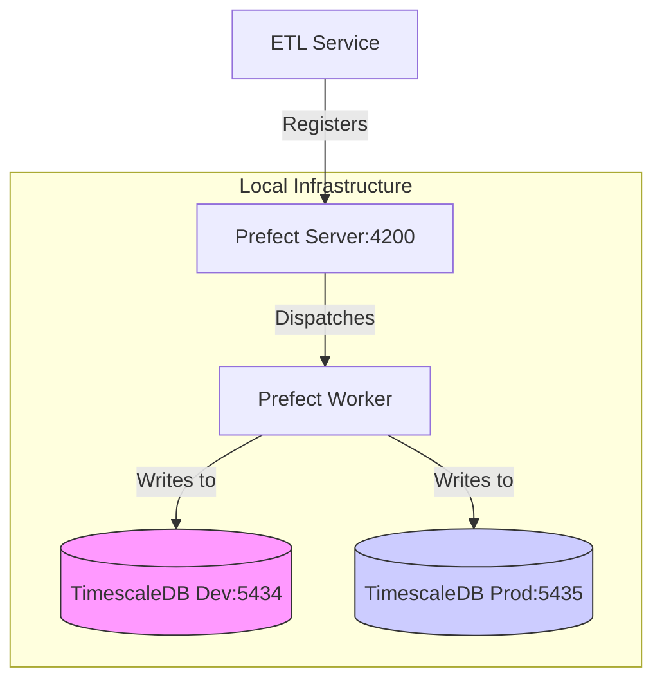

# PR-8: Isolated Databases & Prefixed Deployments

## Purpose
This PR implements a robust data isolation strategy by using separate database instances for "Development" and "Production", while simplifying the orchestration layer to a single Prefect cluster with environment-specific deployment prefixing.

## Architectural Decision: Single Unified Cluster
During development, we explored running multiple isolated Prefect clusters (separate API servers and metadata databases). We decided to transition to a **single unified cluster** for the following reasons:
1.  **Metadata Isolation Limits**: Locally, Prefect 3.x instances often share global state/cache, making absolute metadata isolation complex to maintain on a single machine.
2.  **Resource Efficiency**: Running two full Prefect control planes (Server + Worker) doubles local resource consumption (CPU/RAM).
3.  **Logical Isolation**: By using mandatory environment prefixing (`dev-` and `prod-`), we achieve clear logical separation within the UI and API while maintaining a simpler, more performant local setup.
4.  **Database Isolation**: Crucially, data integrity is still guaranteed as each deployment environment routes its workload to a completely isolated TimescaleDB instance.

## Reviewer Reading Guide
1. **Infrastructure**: Check `docker-compose.yaml` for the dual-database setup.
2. **Configuration**:
    - Review `dev.env` and `prod.env` for the new `ENV_PREFIX` variable.
    - Check `template.dev.env` and `template.prod.env`.
3. **Application Logic**:
    - `apps/etl-service/src/etl_service/etl/deploy_etls.py`: New logic to prepend `ENV_PREFIX` to flow and deployment names.
    - `apps/etl-service/project.json`: Updated `deploy:dev/prod` targets.
    - `apps/prefect-orchestrator/project.json`: Simplified targets for a single cluster.

## Key Changes
- **Database Isolation**: Managed via Docker Compose with `timescaledb-dev` (port 5434) and `timescaledb-prod` (port 5435).
- **Environment Prefixing**:
    - Introduced `ENV_PREFIX` environment variable.
    - Automated prefixing (`dev-` or `prod-`) for all Prefect flows and deployments.
- **Simplified Orchestration**: Transitioned to a single shared Prefect cluster to reduce local resource overhead while maintaining logical separation.
- **Nx Workflow**:
    - Added `deploy:dev` and `deploy:prod` targets to `etl-service`.
    - Integrated `python-dotenv` for reliable environment loading.

## Architecture Diagram

## Date
Wednesday, April 15, 2026
