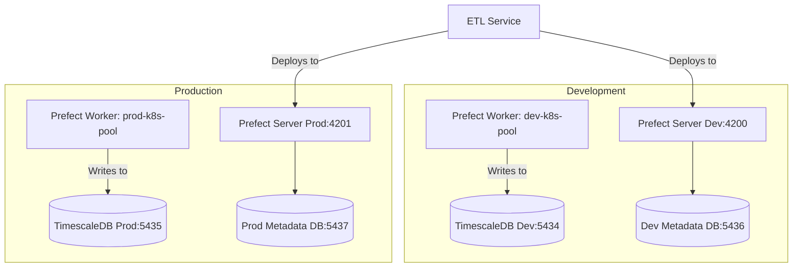

# PR-8: Environment Separation (Dev & Prod)

## Purpose
This PR introduces a formal separation between "Development" and "Production" environments for both the Database (TimescaleDB) and the Orchestration layer (Prefect).

## Reviewer Reading Guide
1. **Infrastructure**: Check `docker-compose.yaml` for the dual-database setup (App DBs + Meta DBs).
2. **Configuration**:
    - Review `dev.env` and `prod.env` for environment-specific variables.
    - Check `template.dev.env` and `template.prod.env` for variable definitions.
3. **Application Logic**:
    - `apps/prefect-orchestrator/project.json`: New `run:dev/prod` and `worker:dev/prod` targets.
    - `apps/etl-service/project.json`: New `deploy:dev/prod` targets.
4. **Dependencies**: `pyproject.toml` updates to include `python-dotenv[cli]`.
5. **Documentation**: Comprehensive updates across `docs/` to reflect the new architecture.

## Key Changes
- **Docker**: Added `docker-compose.yaml` to manage 4 isolated databases:
    - **App DBs**: `timescaledb-dev` (5434), `timescaledb-prod` (5435).
    - **Meta DBs**: `prefect-db-dev` (5436), `prefect-db-prod` (5437).
- **Security & Isolation**:
    - Unique database credentials for each environment.
    - **Absolute Metadata Isolation**: Each Prefect cluster uses its own dedicated PostgreSQL database for metadata.
- **Environment Management**:
    - Created `dev.env` and `prod.env` (ignored by git).
    - Added `template.dev.env` and `template.prod.env` for documentation.
    - Integrated `python-dotenv` CLI for reliable environment variable loading in Nx targets.
- **Prefect Orchestration**:
    - Separate Prefect API URLs (4200 for dev, 4201 for prod).
    - Separate K8s Work Pools (`dev-k8s-pool`, `prod-k8s-pool`).
- **Nx Workflow**:
    - Added granular targets: `start:dev`, `start:prod`, `deploy:dev`, `deploy:prod`.

## Architecture Diagram

## Date
Wednesday, April 15, 2026
