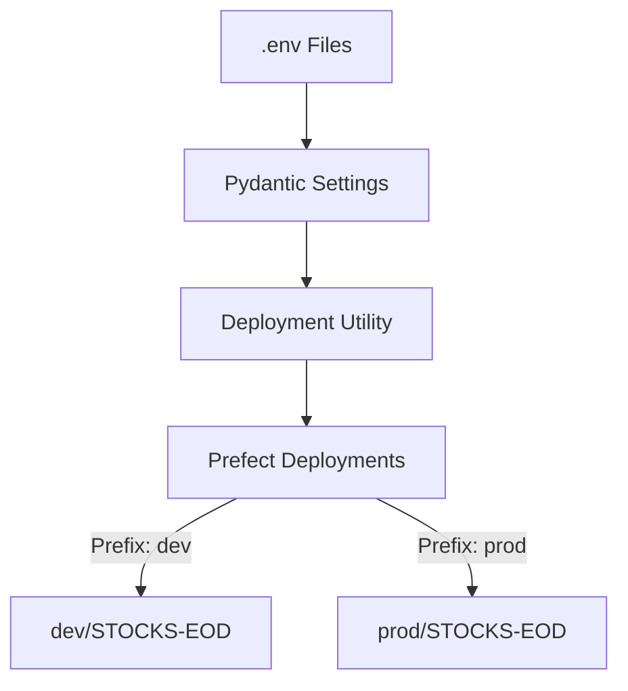

# PR-8: Production Environment Setup and Security Hardening

## Purpose
This PR establishes a robust, environment-aware configuration for the ETL service, ensures security by removing environment files from source control, and implements environment-specific Docker image baking for isolated deployments.

## Reviewer Reading Guide
1. **Security**: `.gitignore` and git removal of `dev.env` and `prod.env`.
2. **Settings**: `apps/etl-service/src/etl_service/etl/deployments_settings/settings.py` for `ENV_PREFIX` loading.
3. **Naming Logic**: `apps/etl-service/src/etl_service/etl/deployments_settings/deps_utils.py` for prefixed flow and deployment names.
4. **Infrastructure**: `Dockerfile.etl` for image baking (ensure consistent environment across K8s/Docker).
5. **Validation**: `apps/etl-service/tests/test_etl_service.py` for prefix verification.

## Key Changes
- **Security**:
    - Stopped tracking `dev.env` and `prod.env` in Git.
    - Verified `.gitignore` properly excludes all `.env` and `*.env` files.
- **Environment-Aware Deployments**:
    - Added `ENV_PREFIX` to Pydantic settings.
    - Updated deployment naming utility to prefix flow names with `{prefix}/` and deployment names with `{prefix}-`.
    - This ensures a single Prefect cluster can host both `dev` and `prd` deployments without name collisions.
- **Docker Isolation**:
    - Implemented `ARG` and `ENV` in `Dockerfile.etl` to bake environment variables directly into images during build time.
- **Testing**:
    - Added unit tests to verify that deployment names are correctly generated based on the `ENV_PREFIX` configuration.
- **Documentation (Tech Learning Center)**:
    - Updated `setup-guide.md`, `docker.md`, `prefect.md`, and `git.md` with environment-specific instructions.
    - Added new high-impact topics:
        - `multi-tenancy.md`: Explaining our single-cluster isolation strategy.
        - `environment-parity.md`: Documenting Twelve-Factor App compliance.
        - `secret-management.md`: Outlining our current and future security roadmap.
        - `pydantic-settings.md`: Technical guide for type-safe environment configuration.
        - `ADR-001`: Formalizing the architectural decision for the single Prefect cluster.

## Architecture

**Date**: 2026-04-15
