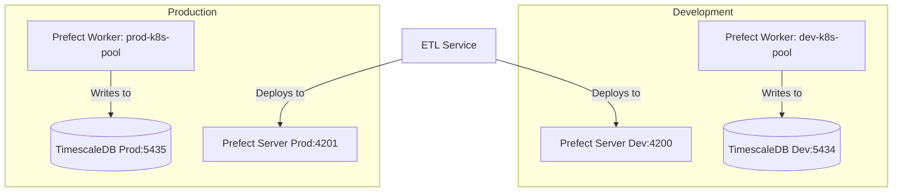

# PR-8: Environment Separation (Dev & Prod)

## Purpose
This PR introduces a formal separation between "Development" and "Production" environments for both the Database (TimescaleDB) and the Orchestration layer (Prefect).

## Reviewer Reading Guide
1. **Infrastructure**: Check `docker-compose.yaml` for the dual-database setup.
2. **Configuration**:
    - Review `.env.dev` and `.env.prod` for environment-specific variables.
    - Check `template.env.dev` and `template.env.prod` for variable definitions and documentation.
3. **Application Logic**:
    - `apps/prefect-orchestrator/project.json`: New `run:dev/prod` and `worker:dev/prod` targets.
    - `apps/etl-service/project.json`: New `deploy:dev/prod` targets.
4. **Dependencies**: `pyproject.toml` updates to include `python-dotenv[cli]`.
5. **Documentation**: Comprehensive updates across `docs/` to reflect the new architecture.

## Key Changes
- **Docker**: Added `docker-compose.yaml` in the root to manage `timescaledb-dev` (port 5434) and `timescaledb-prod` (port 5435).
- **Security & Isolation**:
    - Unique database credentials for each environment (`dev_user`/`dev_pass` vs `prod_user`/`prod_pass`).
- **Environment Management**:
    - Created `.env.dev` and `.env.prod`.
    - Added `template.env.dev` and `template.env.prod` to provide documentation for required variables.
    - Integrated `python-dotenv` CLI for reliable environment variable loading in Nx targets.
- **Prefect Orchestration**:
    - Separate Prefect API URLs (4200 for dev, 4201 for prod).
    - Separate K8s Work Pools (`dev-k8s-pool`, `prod-k8s-pool`).
- **Documentation**:
    - Updated `GEMINI.md` with environment isolation rules.
    - Updated `docs/infrastructure/docker.md` and `docs/infrastructure/kubernetes.md`.
    - Updated `docs/orchestration/prefect.md` and `docs/orchestration/setup-guide.md`.
    - Updated `docs/tooling/nx-uv.md` with `python-dotenv` details.

## Architecture Diagram

## Date
Tuesday, April 14, 2026
