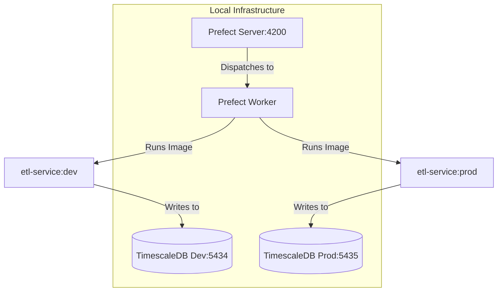

# PR-8: Isolated Databases & Prefixed Deployments

## Purpose
This PR implements a robust data isolation strategy by using separate database instances for "Development" and "Production", while simplifying the orchestration layer to a single Prefect cluster with environment-specific deployment prefixing and isolated Docker images.

## Architectural Decision: Single Unified Cluster
We decided to use a **single unified Prefect cluster** for simplicity and resource efficiency, while achieving absolute isolation through:
1.  **Deployment Naming**: Deployments are named `Flow-Name/dev` and `Flow-Name/prod`.
2.  **Docker Isolation**: We use two distinct Docker images (`etl-service:dev` and `etl-service:prod`) where the specific database credentials and environment prefix are baked into the image at build time.
3.  **Database isolation**: Each image is configured to talk only to its respective TimescaleDB instance.

## Reviewer Reading Guide
1. **Infrastructure**: Check `docker-compose.yaml` for the dual-database setup.
2. **Docker**: Review `Dockerfile.etl` for the new `ARG` and `ENV` configuration mapping.
3. **Application Logic**:
    - `apps/etl-service/src/etl_service/etl/deploy_etls.py`: Logic to use `ENV_PREFIX` for the deployment name.
    - `apps/etl-service/project.json`: Updated `docker-build:dev/prod` targets using `--build-arg`.

## Key Changes
- **Database Isolation**: Managed via Docker Compose with `timescaledb-dev` (5434) and `timescaledb-prod` (5435).
- **Environment-Specific Images**:
    - Build arguments in `Dockerfile.etl` allow baking configuration directly into the image.
    - `etl-service:dev` and `etl-service:prod` now exist as isolated units of execution.
- **Simplified Orchestration**: Transitioned to a single shared Prefect cluster to reduce overhead while maintaining logical separation via deployment names (e.g., `EOD-Saver/dev`).

## Architecture Diagram

## Date
Wednesday, April 15, 2026
