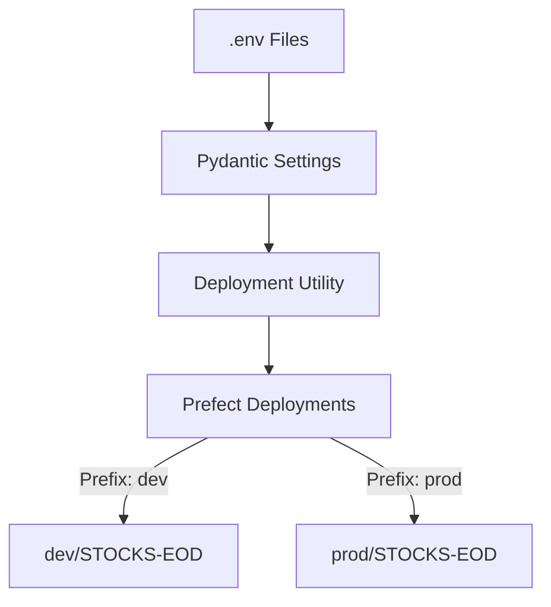

# PR-8: Production Environment Setup and Security Hardening

## Purpose
This PR establishes a robust, environment-aware configuration for the ETL service, ensures security by removing environment files from source control, and implements environment-specific Docker image baking for isolated deployments.

## Reviewer Reading Guide
1. **Security**: `.gitignore` and git removal of `dev.env` and `prod.env`.
2. **Settings**: `apps/etl-service/src/etl_service/etl/deployments_settings/settings.py` for `ENV_PREFIX` loading.
3. **Naming Logic**: `apps/etl-service/src/etl_service/etl/deployments_settings/deps_utils.py` for prefixed flow and deployment names.
4. **Infrastructure**: `Dockerfile.etl` for image baking (ensure consistent environment across K8s/Docker).
5. **Validation**: `apps/etl-service/tests/test_etl_service.py` for prefix verification.

## Key Changes
- **Security**:
    - Stopped tracking `dev.env` and `prod.env` in Git.
    - Verified `.gitignore` properly excludes all `.env` and `*.env` files.
- **Environment-Aware Deployments**:
    - Added `ENV_PREFIX` to Pydantic settings.
    - Updated deployment naming utility to prefix both flow and deployment names with `{prefix}-`.
    - **Fix**: Implemented robust `settings.reload()` logic in `deploy_etls.py` to prevent stale `dev` configuration from being used during production deployments.
    - **Fix**: Refactored `mapper.py` and `base.py` to use dynamic property-based settings, ensuring the correct `work_pool` is assigned based on `ENV_PREFIX`.
- **Infrastructure**:
    - **Prefect**: Created `prod-k8s-pool` (Type: `docker`) to isolate production flow runs.
    - **Orchestrator**: Added `worker:prod` and `start:prod` targets to `prefect-orchestrator` project for easier environment management.
    - **Dependencies**: Added `prefect-docker` as a core dependency to automate worker infrastructure management.
- **Docker Isolation**:
    - Implemented `ARG` and `ENV` in `Dockerfile.etl` to bake environment variables directly into images during build time.
- **Testing**:
    - Verified full production parity by building `etl-service:prod`, registering deployments to `prod-k8s-pool`, and executing a test flow run using the production database.
- **Documentation (Tech Learning Center)**:
    - Updated `setup-guide.md`, `docker.md`, `prefect.md`, and `git.md` with environment-specific instructions and partitioned work pool details.
## Architecture

**Date**: 2026-04-15
