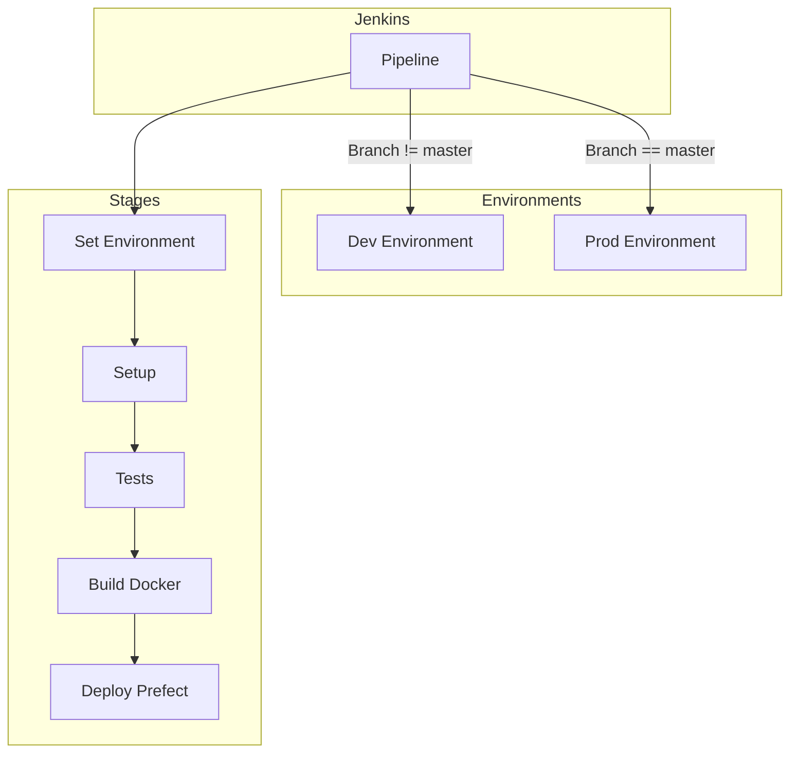

# PR-9: Multi-Environment Jenkins CI/CD Implementation

## Purpose
Implement a robust, scripted Jenkins CI/CD pipeline that supports multiple environments (Dev/Prod). This PR introduces automated branch detection, environment-specific Docker builds, and Prefect flow registration, ensuring that every commit and PR is verified and deployed correctly.

## Reviewer Reading Guide
1. **`Jenkinsfile`**: Review the scripted pipeline logic, especially the environment detection and stage definitions.
2. **`docs/infrastructure/jenkins.md`**: Check the new documentation for clarity and completeness.

## Key Changes

### 1. Scripted Jenkins Pipeline
- Implemented `Jenkinsfile` using Groovy scripting.
- Added **Set Environment** stage for automatic branch-to-environment mapping using a precise regex (`^(.*/)?master$` -> `prod`, others -> `dev`).
- Integrated **Setup** stage using a custom Jenkins agent image with `uv` and Python support.
- Added **Tests** stage with dummy environment variables for Pydantic validation.
- Implemented **Build** stage using environment-specific Docker tags and build-args.
- Added **Deploy** stage that runs inside the newly built application image for 100% dependency consistency.
- **GitHub Integration**: Configured webhook support for real-time build triggers.

### 2. Infrastructure Documentation
- Created `docs/infrastructure/jenkins.md` in the Tech Learning Center.
- Documented pipeline stages, environment isolation strategy, and runner requirements.
- **Connectivity Guide**: Added instructions for using **Ngrok** to connect local Jenkins to GitHub.
- **Setup Recommendation**: Added instructions to use **"Install suggested plugins"** and Docker CLI installation.

## Architecture & Dependency Graph

## Date
Saturday, April 25, 2026
