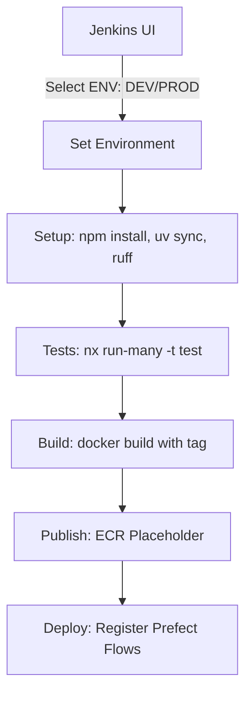

# PR-9: Implement Multi-Environment Jenkins CI/CD Plan

## Purpose
This PR introduces a parameterized `Jenkinsfile` to automate the CI/CD pipeline for both development and production environments. It provides a flexible way to run linting, tests, builds, and deployments for Prefect flows across different clusters and databases.

## Reviewer Reading Guide
1. `Jenkinsfile`: The main pipeline configuration with `ENVIRONMENT` parameter.
2. `docs/infrastructure/jenkins.md`: Updated documentation for the multi-environment Jenkins setup.

## Key Changes
- Added a parameterized `Jenkinsfile` in the root directory.
- Support for `DEV` and `PROD` environments through a selection parameter in the Jenkins UI.
- Configured stages for:
    - **Setup**: Environment initialization and code quality checks with `ruff`.
    - **Tests**: Running project tests for each app in the monorepo.
    - **Build**: Building the `etl-service` Docker image with environment-specific tags (`dev` or `prod`).
    - **Publish**: Placeholder stage for pushing images to a remote ECR repository.
    - **Deploy**: Registering Prefect deployments using the correct environment configuration via `python-dotenv`.
- Environment-specific targeting for Prefect API URLs and database connections.

## Architecture & Dependencies

## Date
2026-04-15
