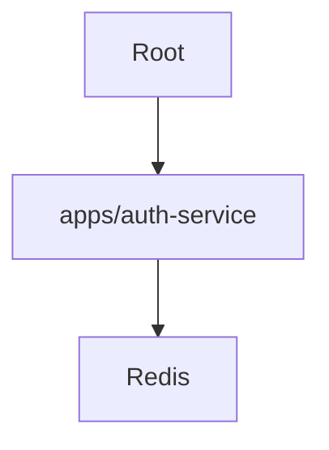

# Pull Request Documentation Assistant

This skill automates the creation of PR documentation files in the `pull_requests/` directory, as required by the project's `GEMINI.md` rules.

## Workflow

1. **Determine PR Number**:
   - List the files in the `pull_requests/` directory.
   - Identify the highest existing number (e.g., if `PR-1.md` exists, the next is `PR-2.md`).
   - If the directory doesn't exist or is empty, start with `PR-1.md`.

2. **Gather Information**:
   - Summarize the changes in the current feature branch compared to the base branch (`master`).
   - Identify the core purpose and key technical changes.

3. **Generate Markdown**:
   - Create a new file `pull_requests/PR-X.md`.
   - Use the following template:

```markdown
# PR #X: [Clear Title]

## Purpose
[Brief explanation of the purpose of the PR]

## Reviewer Reading Guide
To best understand the changes in this PR, please review the files in the following logical order:

1. **[Core/Foundation]**: [File/Directory 1] - [Brief explanation of why to start here]
2. **[Data/Logic]**: [File/Directory 2] - [What to look for]
3. **[Integration/Tests]**: [File/Directory 3] - [Final validation]

## Key Changes
- [Change 1]
- [Change 2]
- ...

## Architectural Changes (Optional)
[Include a Mermaid graph if there are architectural or dependency changes]

---
*Created on: [Current Date]*
```

4. **Mermaid Graphs**:
   - Include a Mermaid graph if the PR introduces new projects, changes dependencies between projects, or modifies the high-level architecture.

## Examples

### Example 1: New Feature
`PR-2.md`
```markdown
# PR #2: Add Authentication Service

## Purpose
Introduces a new microservice for handling user authentication and JWT management.

## Reviewer Reading Guide
1. **Models**: `src/models/user.py` - Understand the user data structure.
2. **Logic**: `src/services/auth.py` - Review the core JWT signing and validation.
3. **API**: `src/api/routes.py` - See how the service is exposed.

## Key Changes
- Created `apps/auth-service`.
- Implemented Login/Signup endpoints.
- Added Redis for session caching.

## Architectural Changes

---
*Created on: April 8, 2026*
```

## Security & Safety
- **No Secrets**: Never include API keys, passwords, or sensitive credentials in the documentation.
- **Privacy**: Avoid mentioning specific local paths or user-specific information unless relevant to the codebase.
